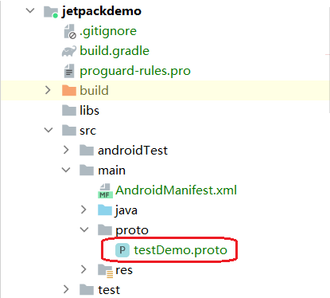
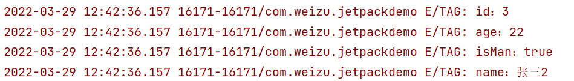

[TOC]
# 1. 前言
`Jetpack DataStore` 是一种数据存储解决方案，允许您使用[协议缓冲区](https://developers.google.cn/protocol-buffers)存储键值对或类型化对象。`DataStore `使用` Kotlin` 协程和` Flow` 以异步、一致的事务方式存储数据。如果您当前在使用`SharedPreferences`存储数据，请考虑迁移到 `DataStore`。如果您需要支持大型或复杂数据集、部分更新或参照完整性，请考虑使用[Room](https://developer.android.google.cn/training/data-storage/room)，而不是 `DataStore`。

# 2. 分类
`DataStore` 提供两种不同的实现：`Preferences DataStore `和 `Proto DataStore`。

*   **Preferences DataStore**使用键值对存储和访问数据。此实现不需要预定义的架构，也不确保类型安全。`DataStore` 是基于 `Flow` 实现的，不会阻塞主线程。只支持`Int`,`Long`,`Boolean`,`Float`,`String`键值对数据，适合存储简单、小型的数据，并且**不支持局部更新**，如果修改了其中一个值，整个文件内容将会被重新序列化。
*   **Proto DataStore**将数据作为自定义数据类型的实例进行存储。此实现要求您使用**协议缓冲区**来定义架构，但可以确保类型安全。 **Proto DataStore**使用[协议缓冲区](https://developers.google.cn/protocol-buffers?hl=zh_cn)来定义架构。使用协议缓冲区可**持久保留强类型数据**。与 XML 和其他类似的数据格式相比，协议缓冲区速度更快、规格更小、使用更简单，并且更清楚明了。虽然使用 `Proto DataStore` 需要学习新的序列化机制，但我们认为 `Proto DataStore` 有着强大的优势，值得学习。

## 2.1 Preferences DataStore 和SharedPreferences的区别
*   `SharedPreferences` 有一个看上去可以在界面线程中安全调用的同步` API`，但是该 `API` 实际上执行磁盘 `I/O` 操作。此外，`apply()`会阻断`fsync()`上的界面线程。每次有服务启动或停止以及每次 `activity` 在应用中的任何地方启动或停止时，系统都会触发待处理的`fsync()`调用。界面线程在`apply()`调度的待处理`fsync()`调用上会被阻断，这通常会导致[ANR](https://developer.android.google.cn/topic/performance/vitals/anr?hl=zh_cn)。

# 3. 实践
## 3.1 Preferences DataStore
### 3.1.1 依赖
~~~
// DataStore Preferences
implementation("androidx.datastore:datastore-preferences:1.0.0")
// optional - RxJava2 support
implementation("androidx.datastore:datastore-preferences-rxjava2:1.0.0")
// optional - RxJava3 support
implementation("androidx.datastore:datastore-preferences-rxjava3:1.0.0")
~~~
### 3.1.2 案例
下面案例来源于官网案例，地址：[DataStore  |  Android 开发者  |  Android Developers (google.cn)](https://developer.android.google.cn/topic/libraries/architecture/datastore#kotlin)。
~~~
class MainActivity2 : AppCompatActivity() {
    // 创建一个DataStore，并申明在顶层以方便调用
    private val Context.dataStore: DataStore<Preferences> by preferencesDataStore(name = "settings")

    // 声明一个int类型的key
    val EXAMPLE_COUNTER = intPreferencesKey("example_counter")
    private val textView: TextView by lazy { findViewById(R.id.text) }

    override fun onCreate(savedInstanceState: Bundle?) {
        super.onCreate(savedInstanceState)
        setContentView(R.layout.activity_main)
    }
    
    // 两个按钮的监听事件
    fun buttonOnClick(view: View){
        runBlocking {
            launch {
                when(view.id){
                    R.id.update -> {
                        incrementCounter()
                    }
                    R.id.read -> {
                        textView.text = getData().toString()
                    }
                }
            }
        }
    }

    // 存储-自增1
    suspend fun incrementCounter() {
        dataStore.edit { settings ->
            val currentCounterValue = settings[EXAMPLE_COUNTER] ?: 0
            settings[EXAMPLE_COUNTER] = currentCounterValue + 1
        }
    }

    // 获取当前值
    suspend fun getData(): Int {
        return dataStore.data.map { settings ->
            settings[EXAMPLE_COUNTER] ?: 0
        }.first()
    }
}
~~~
结果：

### 3.1.3 最后
在前面提到了，这种类型的`Preferences DataStore`还支持的数据类型有：`Long`,`Boolean`,`Float`,`String`等，不妨看看对应的声明函数：
~~~
longPreferencesKey()
booleanPreferencesKey()
floatPreferencesKey()
stringSetPreferencesKey()
~~~
对应的，随便找一个方法，看下是如何实现的：
~~~
@JvmName("longKey")
public fun longPreferencesKey(name: String): Preferences.Key<Long> = Preferences.Key(name)
~~~
也就是其实底层也还是使用`Preferences.Key<Long>`来指明类型。和`SP`类似数据内容也存储在本地磁盘`data/data/packagename/`中：

## 3.2 Proto DataStore
对于`Preferences DataStore `中的键只能为上述指定的类型，故而如果我们需要存储自定义对象的数据的时候，就显得力不从心了。故而在`jetpack`中提供了`Proto DataStore`。

### 3.2.1 依赖
引入`datastore`的依赖：
~~~
implementation("androidx.datastore:datastore:1.0.0")
// optional - RxJava2 support
implementation("androidx.datastore:datastore-rxjava2:1.0.0")
// optional - RxJava3 support
implementation("androidx.datastore:datastore-rxjava3:1.0.0")
~~~
为了使用 `Proto DataStore`，让协议缓冲区为我们的架构生成代码，我们需要对 `build.gradle` 文件进行一些更改：
#### 3.2.1.1 添加协议缓冲区插件
~~~
plugins {    
    ...    
    id "com.google.protobuf" version "0.8.12"
}
~~~
#### 3.2.1.2 配置协议缓冲区
~~~
implementation  "com.google.protobuf:protobuf-javalite:3.10.0"
~~~
在`dependencies`平级添加：
~~~
protobuf {
    protoc {
        artifact = "com.google.protobuf:protoc:3.10.0"
    }

    // Generates the java Protobuf-lite code for the Protobufs in this project. See
    // https://github.com/google/protobuf-gradle-plugin#customizing-protobuf-compilation
    // for more information.
    generateProtoTasks {
        all().each { task ->
            task.builtins {
                java {
                    option 'lite'
                }
            }
        }
    }
}
~~~

### 3.2.2 定义架构
在`app/src/main/`目录下创建`proto`目录，然后创建一个`xxx.proto`文件：

`testDemo.proto`文件内容：
~~~
syntax = "proto3"; // 声明proto的版本

//  定义生成的类的包名
option java_package = "com.weizu.jetpackdemo.proto";
    
// 声明的是内部类MyProtoBean, 格式: 类型+字段名称+字段编号
message MyProtoBean {
  int32 _id = 1;
  string _name = 2;
  int32 _age = 3;
  bool _isMan = 4;
}
~~~
至于更加详细的解释可以查阅：[protobuf 语言指南](https://developers.google.cn/protocol-buffers/docs/proto3)以及[使用 Proto DataStore (google.cn)](https://developer.android.google.cn/codelabs/android-proto-datastore?hl=zh_cn#3)

然后`Build`一下，就可以看到生成的文件：

打开文件可以看到在该文件中生成了配置中对应的`message`类，和对应的`set/get`方法：

至此环境配置完毕，接着开始简单使用。
### 3.2.3 简单使用
#### 3.2.3.1 创建序列化器
我们需要实现序列化器，以告知 DataStore 如何读取和写入我们在 proto 文件中定义的数据类型。如果磁盘上没有数据，序列化器还会定义默认返回值。
~~~
object MyBeanSerializer: Serializer<TestDemo.MyProtoBean> {
    override val defaultValue: TestDemo.MyProtoBean
        get() = TestDemo.MyProtoBean.getDefaultInstance()
    override suspend fun readFrom(input: InputStream): TestDemo.MyProtoBean {
        try {
            return TestDemo.MyProtoBean.parseFrom(input)
        } catch (exception: InvalidProtocolBufferException) {
            throw CorruptionException("Cannot read proto.", exception)
        }
    }
    override suspend fun writeTo(t: TestDemo.MyProtoBean, output: OutputStream) {
        t.writeTo(output)
    }
}
~~~

#### 3.2.3.2 数据存储和读取
~~~
/**
 * @author 梦否 on 2022/3/28
 * @blog https://mengfou.blog.csdn.net/
 */
class MainActivity2 : AppCompatActivity() {

    private val textView: TextView by lazy { findViewById(R.id.text) }

    private val dataStore: DataStore<TestDemo.MyProtoBean> by lazy {
        DataStoreFactory.create(
            produceFile = { applicationContext.dataStoreFile("user_prefs.pb") },
            serializer = MyBeanSerializer
        )
    }

    override fun onCreate(savedInstanceState: Bundle?) {
        super.onCreate(savedInstanceState)
        setContentView(R.layout.activity_main)
    }

    private var i = 0

    // 按钮监听函数
    fun buttonOnClick(view: View) {
        runBlocking {
            launch {
                when (view.id) {
                    R.id.update -> {
                        storeData(1 + i, 20 + i, true, "张三${i}")
                        i++
                    }
                    R.id.read -> {
                        val first = readData().first()
                        Log.e("TAG", "id：${first.id}")
                        Log.e("TAG", "age：${first.age}")
                        Log.e("TAG", "isMan：${first.isMan}")
                        Log.e("TAG", "name：${first.name}")
                    }
                }
            }
        }
    }

    // 读取数据时处理异常
    private fun readData(): Flow<TestDemo.MyProtoBean> {
        return dataStore.data
            .catch { exception ->
                // dataStore.data throws an IOException when an error is encountered when reading data
                if (exception is IOException) {
                    Log.e("TAG", "Error reading sort order preferences.", exception)
                    emit(TestDemo.MyProtoBean.getDefaultInstance())
                } else {
                    throw exception
                }
            }
    }

    // 添加数据
    private suspend fun storeData(id: Int, age: Int, isMan: Boolean, name: String) {
        dataStore.updateData { preferences ->
            preferences.toBuilder()
                .setAge(age)
                .setId(id)
                .setIsMan(isMan)
                .setName(name)
                .build()
        }
    }
}
~~~
结果：

每次插入数据都会覆盖掉以前的数据，也就是在使用对象存储数据的时候，只能存储一条数据。

