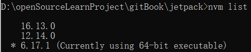
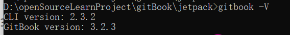
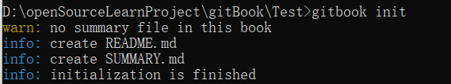
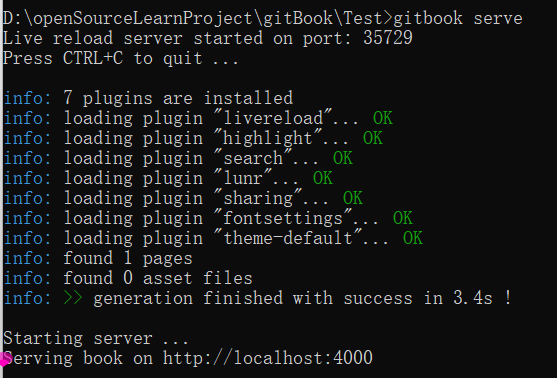
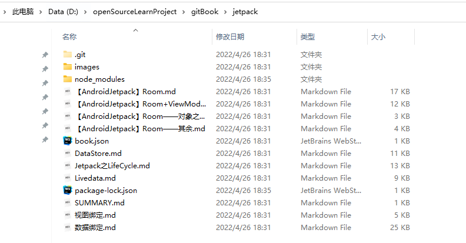
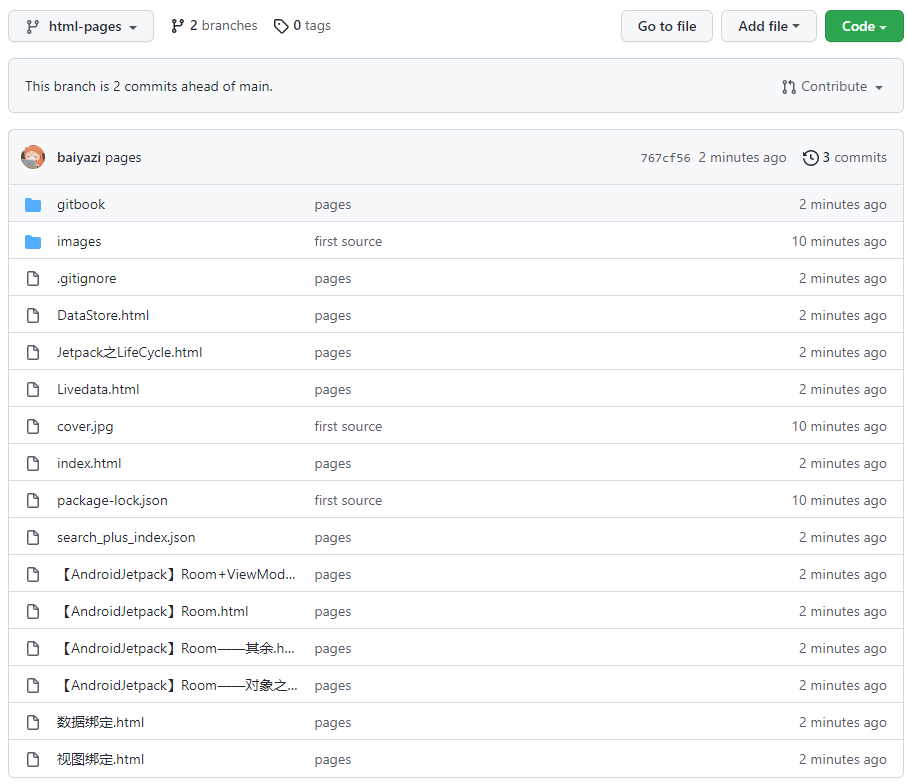

# 1. 安装
安装一个低版本的`node`，对于多个`node`的管理可以使用`nvm`工具。涉及到的两个命令为：
```
nvm list [available]
nvm use [version] [arch]
```
比如当前我的版本为：


如果需要指定其余的版本，可以使用：
```
nvm install 16.13.0
```
来进行安装，如果需要知道版本号，可以使用：
~~~
nvm ls available
~~~
来进行查看。这里我安装：
```
>nvm install 8.11.1
```
切换版本：
```
>nvm use 8.11.1
```
但很不幸这个版本在[阿里镜像](https://registry.npmmirror.com/binary.html?path=npm/)中没有`npm`，所以换为`8.17.0`，详细的`node`版本和对应的`npm`版本对应关系链接：[以往的版本 | Node.js (nodejs.org)](https://nodejs.org/zh-cn/download/releases/)。

然后使用`npm`命令安装`gitbook`：
```
>npm install gitbook-cli -g
```
然后指定安装版本：
```
>gitbook fetch 2.6.7
```
使用`>gitbook -V`可查看当前版本：


其他命令：
> gitbook ls-remote： 列出可供安装的远程版本

# 2. 使用
然后在自己所在的项目目录下，初始化项目，使用命令：
```
gitbook init
```
初始化完毕后，生成两个文件：


最后的文档就是在同一个目录中写作完成即可。生成和运行使用：
```
gitbook serve
```
结果：

打开对应的链接可以访问到结果。即：


且对应的本地生成了静态网页文件：


值得高兴的一件事情就是，在看云平台下载的`git`文档刚好满足条件。比如，以我的`Jetpack`笔记为例，下载下来为：



# 3. 配置

对于`gitbook`的相关操作可以查阅文档：[搜索 | GitBook文档（中文版） (gitbooks.io)](https://chrisniael.gitbooks.io/gitbook-documentation/content/platform/search.html)


在`book.json`文件中，可以做一些简单的配置，可以参考这篇博客：[GitBook-如何安装？介绍book.json的实用配置和插件，弹出查看大图\_你知不知的博客-CSDN博客](https://blog.csdn.net/qq_42899245/article/details/118703813)

这里我配置如下：
```json
{
  "title": "Jetpack",
  "author": "梦否",
  "description": "This is such a great book!",
  "language": "zh-hans",
  "direction": "rtl",
  "styles": {
    "website": "styles/website.css",
    "ebook": "styles/ebook.css",
    "pdf": "styles/pdf.css",
    "mobi": "styles/mobi.css",
    "epub": "styles/epub.css"
  },
  "plugins": [
    "back-to-top-button",
    "expandable-chapters-small",
    "insert-logo",
    "popup",
    "page-treeview",
    "code",
    "chapter-fold",
    "tbfed-pagefooter",
    "splitter"
  ],
  "pluginsConfig": {
    "tbfed-pagefooter": {
      "copyright": "Copyright &copy 梦否 2019",
      "modify_label": "该文件修订时间：",
      "modify_format": "YYYY-MM-DD HH:mm:ss"
    },
    "page-treeview": {
      "copyright": "Copyright &#169; 梦否",
      "minHeaderCount": "2",
      "minHeaderDeep": "2"
    }
  }
}

```

还可以添加自己的博客链接，GIthub链接等：

```
"links": {
 "sidebar": {
 "Blog": "https://mengfou.blog.csdn.net/",
 "Github": "https://github.com/baiyazi"
    }
  }
```

配置好后，使用：
```
gitbook install
```
来安装插件，安装完毕后，使用：
```
>gitbook serve
```

生成新的静态文件。

___
一些额外功能。可以参考博客：[Gitbook 插件和主题 | Dastone's Notes (szdastone.github.io)](https://szdastone.github.io/posts/2019/01/4dd0f083.html)
关于其插件，可以参考：[插件 · GitBook 使用教程 (zhangjikai.com)](http://gitbook.zhangjikai.com/plugins.html?q=)、[GitBook 常用插件 - 走看看 (zoukankan.com)](http://t.zoukankan.com/levywang-p-13569661.html)

## 3.1 目录配置
~~~
"theme-default": {
        "showLevel": true
    }
~~~
将 showLevel 设为 true，这样就会显示标题前面的数字索引，默认是不显示的。
## 3.2 主题
~~~
"plugins": [
        "theme-comscore"
 	]
~~~
comscore 可以为标题增加颜色，而缺省主题都是黑白色的。


# 4. 发布
首先需要先安装 gh-pages:
~~~
>npm i gh-pages -g
~~~
然后使用:
```
>gitbook build
```
编译一下，确保目录下有`_book`目录。然后上传文件到`github`，这里新建一个`. gitignore`文件，配置：
```
\*~
node\_models/\*
```
然后在`github`新建一个`JetpackNotes`仓库，这里为了方便我在本地使用`gitDesktop`打开，然后进行操作管理。将源码上传到`Master`分支，将生成的`_book`上传到`gh-pages`
分支。需要注意的是`html-pages`分支确保放置`HTML`文件。


比如，我这里仓库为：https://github.com/baiyazi/JetpackNotes/


然后在设置中进行发布：


当然，也可以直接查看[项目](https://github.com/baiyazi/JetpackNotes/)中的一些配置。这里不再继续介绍。

