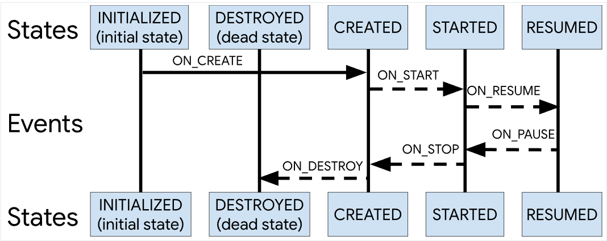
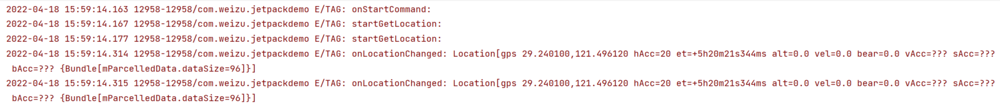
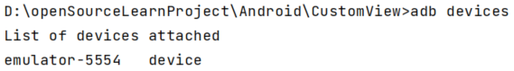
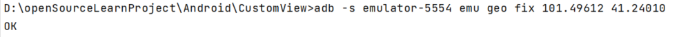
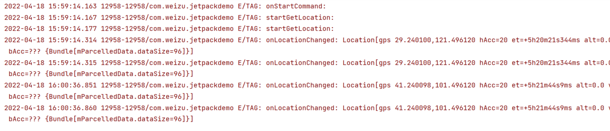
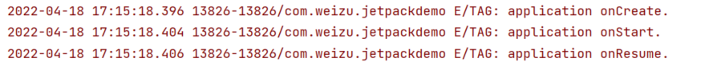

[TOC]
# 1. 说明
`LifeCycle`它持有组件的生命周期状态信息，主要用于`Activity`、`Fragment`、`Service`和`Application`的生命周期管理，其他类可以观察到这些状态，进而有利于代码的解耦。而且在配置更改后可以轻松避免内存泄漏，以及将数据加载到界面中。


比如在Activity 生命周期的状态和事件：


# 2. Lifecycle
在`Lifecycle`中存在**两类角色**：
* 具有生命周期的组件，比如`Activity`、`Fragment`、`Service` 等任何具有生命周期的组件，通常被称为`LifecycleOwner`，也即是被观察者。
* `LifecycleObserver`，即观察者，需要感知生命周期方法。

很明显，也就是观察者模式。由于在上述组件中已经实现了`LifecycleObserver`接口，比如在`Activity`中：
~~~java
public class ComponentActivity extends androidx.core.app.ComponentActivity implements
        ContextAware,
        LifecycleOwner,
        ...
~~~
并实现了其`getLifecycle`方法，故而在观察者模式中被观察者已经由系统实现，我们所需要做的也就是实现观察者类，也即是自定义类，实现`LifecycleObserver`接口，然后设置观察即可。

## 2.1 LifecycleObserver 
而该接口又只是一个空接口，即仅用作标识：
~~~java
public interface LifecycleObserver {
}
~~~

## 2.2 LifecycleOwner
LifecycleOwner 是一个接口，用来表示类具有`Lifecycle`。其声明如下：
~~~java
public interface LifecycleOwner {
    @NonNull
    Lifecycle getLifecycle();
}
~~~
可以看见只有一个方法，也就是getLifecycle()，

可以通过调用Lifecycle类的addObserver()方法并传递观察器的实例来添加观察器，比如下面的代码：
~~~kotlin
class MyObserver : DefaultLifecycleObserver {
    override fun onResume(owner: LifecycleOwner) {
        connect()
    }

    override fun onPause(owner: LifecycleOwner) {
        disconnect()
    }
}

myLifecycleOwner.getLifecycle().addObserver(MyObserver())
~~~

# 3. 案例
比如下面的案例：
## 3.1 案例一：使用LifeCycle解耦页面组件
学习视频地址：[LifeCycle](https://www.bilibili.com/video/BV1Ry4y1t7Tj?p=2&spm_id_from=pageDriver)

不使用LifeCycle的时候，通过Chronometer计时器来做一个简单的计时操作，满足下面条件：
* 当`Activity`可见的时候，继续计时；
* 当`Activity`不可见的时候，且还没有被Destory的时候，就暂停当前计时；

### 3.1.1 借助生命周期方法
~~~
class MainActivity : AppCompatActivity() {

    // 继承自TextView的一个计时器类
    private lateinit var chronometer: Chronometer

    override fun onCreate(savedInstanceState: Bundle?) {
        super.onCreate(savedInstanceState)
        setContentView(R.layout.activity_main)
        chronometer = findViewById(R.id.chronometer)

    }

    private var elapsedtime = 0L

    // 可见
    override fun onResume() {
        super.onResume()
        // 设置计时器的起始时间为“当前”系统时间
        // SystemClock.elapsedRealtime() 从设备开机到现在的时间
        chronometer.base = SystemClock.elapsedRealtime() - elapsedtime
        chronometer.start()
    }

    // 不可见
    override fun onStop() {
        super.onStop()
        elapsedtime = SystemClock.elapsedRealtime() - chronometer.base
        chronometer.stop()
    }
}
~~~
上面设置`chronometer.base`，主要是用于设置计时器的“当前起始时间”，主要是为了确保暂停后开始的基准时间可以略过中间暂停事件，确保计时器在`Activity`可见后可以连续计时。但是，很显然，这样多余了很多额外的周期函数方法，使用比较麻烦。而使用`LifeCycle`可以对其进行最大程度简化。而且在组件化开发中，基本的原则就是：**能不麻烦别人的事情就尽量自己做**。需要暴露更少的方法来完成其功能。
### 3.1.2 借助LifeCycle
首先封装一下Chronometer这个类，声明其实现了LifecycleObserver接口：
~~~
class MyChronometer: Chronometer, LifecycleObserver {
    constructor(context: Context?) : super(context)
    constructor(context: Context?, attrs: AttributeSet?) : super(context, attrs)

    private var elapsedtime = 0L

    @OnLifecycleEvent(Lifecycle.Event.ON_RESUME)
    fun startChronometer(){
        // 设置计时器的起始时间为“当前”系统时间
        base = SystemClock.elapsedRealtime() - elapsedtime
        start()
    }

    @OnLifecycleEvent(Lifecycle.Event.ON_STOP)
    fun stopChronometer(){
        elapsedtime = SystemClock.elapsedRealtime() - base
        stop()
    }
}
~~~
将前面案例中的代码添加到其中，并为其指定了对应的`Lifecycle`事件方法。对应的将`xml`中修改为我们自定义的`MyChronometer`类，然后调用：
~~~
class MainActivity1 : AppCompatActivity() {

    // 继承自TextView的一个计时器类
    private lateinit var chronometer: MyChronometer

    override fun onCreate(savedInstanceState: Bundle?) {
        super.onCreate(savedInstanceState)
        setContentView(R.layout.activity_main)
        chronometer = findViewById(R.id.chronometer)
        // 为Activity的lifecycle添加一个监听
        lifecycle.addObserver(chronometer)
    }
}
~~~
就可以看见一样满足要求的计时器。这两个案例做一个简单的对比，很明显第二种写法更加利于系统组件和普通组件的**代码解耦**。这里可以总结一下上面的使用流程：
* 自定义一个类，实现了`LifecycleObserver`接口；
* 在`Activity`或者`Fragment`中进行添加观察者，以**监听**对应的生命周期函数；

## 3.2 案例二：使用LifeCycleService解耦Service组件
视频地址：https://www.bilibili.com/video/BV1Ry4y1t7Tj?p=3&t=863.3
该案例以模拟获取GPS为案例，具体为在后台开启一个Service，然后在这个Service中注册观察者对象，在这个观察者对象中可以观察到Activity的onStart、onStop等事件。也就可以自动完成进入这个Activity就开始获取地理位置的更新，退出这个Activity就停止获取位置。

### 3.2.1. 基础版本
如果获取用户地理位置的功能没有独立封装为一个组件，那么我们如果需要考虑页面声明周期，那么就需要按照下面的形式，因为非自定义组件并不能主动感知声明周期的变化。
~~~kotlin
class LocationActivity: AppCompatActivity() {

    override fun onCreate(savedInstanceState: Bundle?) {
        super.onCreate(savedInstanceState)
        val binding = DataBindingUtil.setContentView<ActivityLocationBinding>(
            this,
            R.layout.activity_location
        )
    }
    
    override fun onResume() {
        super.onResume()
        // 开始获取用户地理位置
        startGetLocation()
    }

    override fun onPause() {
        super.onPause()
        // 停止获取
        stopGetLocation()
    }
}
~~~
### 3.2.2. 使用Service
上面的第一种方式明显的缺点就是耦合度很高，所以为了减少耦合度，而又不影响对生命周期的监听，就可以使用`LifeCycle`来进行改写。故而我们可以自定义一个类，然后使用`LifecycleObserver`来标识这个类为`LifeCycle`的一个观察者类，在这个类中完成自定义控件，即具体功能。
~~~kotlin
class MyLocationObserver(context: Context): LifecycleObserver {
    private var mCtx : Context = context
    private lateinit var myLocationListener: MyLocationListener
    private lateinit var locationManager: LocationManager
    
    @OnLifecycleEvent(Lifecycle.Event.ON_START)
    private fun startGetLocation(){
        Log.e("TAG", "startGetLocation: ")
        // 获取LocationManager
        locationManager = mCtx.getSystemService(Context.LOCATION_SERVICE) as LocationManager
        // 权限
        if (ActivityCompat.checkSelfPermission(
                mCtx,
                Manifest.permission.ACCESS_FINE_LOCATION
            ) != PackageManager.PERMISSION_GRANTED && ActivityCompat.checkSelfPermission(
                mCtx,
                Manifest.permission.ACCESS_COARSE_LOCATION
            ) != PackageManager.PERMISSION_GRANTED
        ) {
            return
        }
        // 添加监听
        myLocationListener = MyLocationListener()
        locationManager.requestLocationUpdates(LocationManager.GPS_PROVIDER, 3000, 2f, myLocationListener)
    }

    inner class MyLocationListener: LocationListener{
        override fun onLocationChanged(location: Location) {
            Log.e("TAG", "onLocationChanged: ${ location }" )
        }
    }
    
    @OnLifecycleEvent(Lifecycle.Event.ON_STOP)
    private fun stopGetLocation(){
        Log.e("TAG", "stopGetLocation: ", )
        // 移除
        locationManager.removeUpdates(myLocationListener)
    }
}
~~~
当页面生命周期发生变化时，这些使用`@OnLifecycleEvent`标识过的方法便会被自动调用。那么在调用的时候，由于`Activity`或者`Service`均已经实现了被观察者`LifecycleOwner`的接口，故而这里直接调用实现这个接口的`getLifecycle`方法，得到`Lifecycle`对象，然后添加观察者：
~~~kotlin
lifecycle.addObserver(MyLocationObserver(this))
~~~

注意到，本小节的标题为使用`Service`，这里我们可以使用比较经典的写一个类继承自`Service`，根据自己所使用的启动方式，即`startService`或者`bindService`来复写对应的`onStartCommand`或者`onBind`方法。然后在`Activity`中进行`startService`或者`bindService`。比如：
~~~kotlin
class MyService: LifecycleService() {

    private var _observer: MyLocationObserver = MyLocationObserver(this)

    init {
        lifecycle.addObserver(_observer)
    }

    override fun onStartCommand(intent: Intent?, flags: Int, startId: Int): Int {
        Log.e("TAG", "onStartCommand: ")
        // 注册观察者
        val myLocationObserver = MyLocationObserver(this)
        lifecycle.addObserver(myLocationObserver)
        return super.onStartCommand(intent, flags, startId)
    }

    override fun onDestroy() {
        super.onDestroy()
        lifecycle.removeObserver(_observer)
    }
}
~~~
然后在主`Activity`中启动服务：
~~~kotlin
class LocationActivity: AppCompatActivity() {

    override fun onCreate(savedInstanceState: Bundle?) {
        super.onCreate(savedInstanceState)
        val binding = DataBindingUtil.setContentView<ActivityLocationBinding>(
            this,
            R.layout.activity_location
        )

        // 启动服务
        startService(Intent().apply {
            setClass(this@LocationActivity, MyService::class.java)
        })
    }
}
~~~
运行可以看见结果：


然后可以使用`adb devices`查看一下设备：


然后可以使用`adb`命令修改模拟位置：
```
adb -s emulator-5554 emu geo fix 101.49612 41.24010
```

就可以发现日志进行了更新：


## 3.3.  案例三：监听应用程序的生命周期
在`LifeCycle`中提供了`ProcessLifecycleOwner`来实现监听应用程序的声明周期。同样的，这里还是自定义一个类，继承自`LifecycleObserver`：
~~~kotlin
class MyApplicationObserver : LifecycleObserver {

    @OnLifecycleEvent(Lifecycle.Event.ON_CREATE)
    private fun onCreate() {
        Log.e("TAG", "application onCreate.")
    }

    @OnLifecycleEvent(Lifecycle.Event.ON_START)
    private fun onStart() {
        Log.e("TAG", "application onStart.")
    }

    @OnLifecycleEvent(Lifecycle.Event.ON_RESUME)
    private fun onResume() {
        Log.e("TAG", "application onResume.")
    }
}
~~~
然后在`Activity`中使用：
~~~
class LocationActivity: AppCompatActivity() {

    override fun onCreate(savedInstanceState: Bundle?) {
        super.onCreate(savedInstanceState)
        val binding = DataBindingUtil.setContentView<ActivityLocationBinding>(
            this,
            R.layout.activity_location
        )
        // 添加应用程序生命周期观察者对象
        ProcessLifecycleOwner.get().lifecycle.addObserver(MyApplicationObserver())
    }
}
~~~
就可以监听到应用程序的生命周期变化。


- ProcessLifecycleOwner是针对整个应用程序的监听，与Activity数量无关；
- Lifecycle.Event.ON_CREATE只会被调用一次，而Lifecycle.Event.ON_DESTROY永远不会被调用。


