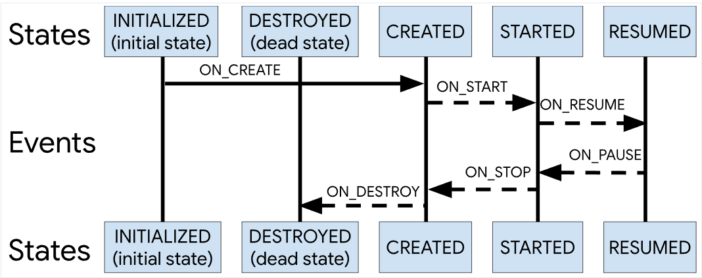

[toc]
# 1. 前言
官网地址：[https://developer.android.google.cn/topic/libraries/architecture/livedata](https://developer.android.google.cn/topic/libraries/architecture/livedata)

其实在使用`ViewModel`和`LifeCycle`的时候，我们已经看见了`LiveData`这个组件。在这篇博客中将继续来了解这个组件。其特点：
- `LiveData`是一种**可观察的数据存储器类**；
- 与常规的可观察类不同，`LiveData`**具有生命周期感知能力**。其感知能力遵循其他组件（如 `Activity`、`Fragment` 或 `Service`）的生命周期；
- 感知能力可确保`LiveData`**仅更新处于活跃生命周期状态**的应用组件观察者；活跃的观察者对象声明周期处于`STARTED `或 `RESUMED` 状态；
- `LiveData`只会将更新通知给**活跃的观察者**，非活跃观察者不会收到更改通知；
- 当观察者组件的`Lifecycle`对象的状态变为 `DESTROYED` 时，便可移除此观察者，不必担心泄露（当 `Activity `和` Fragment `的生命周期被销毁时，系统会立即退订它们）。


不妨再次看下这个图：


## 1.1 关于观察者模式
我们知道观察者模式，在`Java`中提供了`Observable`和`Observer`来定义被观察者和观察者对象。然后对于可观察对象可以设置观察者，来监听其变化。而在`Android`的`Lifecycle`包中提供了对应的`LifecycleOwner`和`LifecycleObserver`，而在`Activity`、`Fragment` 或 `Service`等组件中已经实现了`LifecycleOwner`接口，我们在使用的时候，只需要实现`LifecycleObserver`来标识类是一个观察者，以注册观察。在之前的博客：[【Android Jetpack】LifeCycle](https://mengfou.blog.csdn.net/article/details/124254857)一文中也曾提到过通过：
```kotlin
lifecycle.addObserver(myLocationObserver)
```
来为`lifecycle`来设置一个观察者对象。类似的，前面提到了：`LiveData`也是一种可观察的数据存储器类。故而也可以设置观察对象，比如：
~~~kotlin
// viewModel.get() 获取的为LiveData对象
viewModel.get().observe(this, object : androidx.lifecycle.Observer<Int>{
    override fun onChanged(value: Int?) {
        livedataText.text = viewModel.getValue().toString()
    }
})
~~~
# 2. LiveData 的优势
- 确保界面符合数据状态；`LiveData` 遵循观察者模式。当底层数据发生变化时，`LiveData` 会通知 `Observer` 对象。您可以整合代码以在这些 `Observer` 对象中更新界面。
- 不会发生内存泄漏；观察者会绑定到 `Lifecycle` 对象，并在其关联的生命周期遭到销毁后进行自我清理。
- 不会因 `Activity` 停止而导致崩溃；如果观察者的生命周期处于非活跃状态，则它不会接收任何 `LiveData` 事件。
- 不再需要手动处理生命周期；
- 共享资源；可以使用单例模式扩展 `LiveData` 对象以封装系统服务，以便在应用中共享它们。`LiveData` 对象连接到系统服务一次，然后需要相应资源的任何观察者只需观察 `LiveData` 对象。

更加通俗来说，`LiveData`是一个持有`Activity`、`Fragment`生命周期的数据容器。当数据源发生改变的时候，可以通知观察者。

## 2.1 案例一：计时器效果
在`Activity`中定义一个文本，在该控件上每秒自动加一操作。且屏蔽设备配置发生改变后不影响其状态。比如布局文件为`ConstraintLayout`下放置一个居中的`TextView`。

### 2.1.1 实现方式一：ViewModel+LiveData
- 因为需要屏蔽设备配置发生改变的影响，故而这里考虑直接使用`ViewModel`；
- 考虑代码解耦，这里使用`LiveData`来设置观察者，也即是我们需要在`ViewModel`中设置数据类型为`LiveData`；

自定义的`ViewModel`如下：
~~~kotlin
class MyNumberViewModel : ViewModel() {
    private var number: MutableLiveData<Int> = MutableLiveData(0)

    fun set(value: Int) {
        number.value = value
    }

    // 工作线程需要使用Post
    fun post(value: Int) {
        number.postValue(value)
    }

    fun get(): LiveData<Int> {
        return number
    }

    fun getValue(): Int{
        return number.value?:0
    }
}
~~~
因为我们需要使用`LiveData`对象来注册观察者对象，故而这里`get()`方法返回的是`LiveData`对象。且因为需要开启定时任务，故而可以在工作线程完成，所以提供了`post`方法，然后在`Activity`中进行设置：
~~~kotlin
class LiveDataActivity : AppCompatActivity() {

    private lateinit var viewModel: MyNumberViewModel
    private val livedataText: TextView by lazy { findViewById(R.id.livedata_text)}

    override fun onCreate(savedInstanceState: Bundle?) {
        super.onCreate(savedInstanceState)
        setContentView(R.layout.activity_live_data)

        // 获取到ViewModel
        viewModel = ViewModelProvider(
            this,
            ViewModelProvider.NewInstanceFactory()
        ).get(MyNumberViewModel::class.java)

        // 为TextView设置数据
        livedataText.text = viewModel.get().toString()

        // 开始定时任务
        startTimer()

        // 注册一个观察者，监听到ViewModel中数据的变化，如果变化执行onChanged()方法
        // viewModel.get() 获取的为LiveData对象
        viewModel.get().observe(this, object : androidx.lifecycle.Observer<Int>{
            override fun onChanged(value: Int?) {
                livedataText.text = viewModel.getValue().toString()
            }
        })
    }

    // 定时任务
    private fun startTimer(){
        Timer().schedule(
            object : TimerTask() {
                override fun run() {
                    viewModel.post(viewModel.getValue() + 1)
                }
            },
            1000, 1000,
        )
    }
}
~~~
运行即可看见预想的效果。看完上述案例代码之后是否会有疑惑？肯定是有的，因为这里是`LiveData`的案例，却引入了`ViewModel`，且将`LiveData`放入了自定义的`ViewModel`类中，为什么需要这么做？`LiveData`对象本身就可以被观察，为什么还需要放置到`ViewModel`中？
答：其实在刚开始的要求部分我已经做了引导，需要做到**屏蔽设备配置发生改变后不影响其状态**，而很方便的`ViewModel`就可以轻松做到这一点。如果`LiveData`实例与特定的 `Activity` 或 `Fragment` 实例并没有分离开，那么在 `Activity` 或 `Fragment` 经历`onDestory`的时候，`LiveData`中的数据也就没了。

且上述程序存在一个致命`Bug`，由于每次屏幕旋转都会执行`onCreate`，故而会开启多个定时任务，故而这里是不符合题意的。当然，可以加上标志处理，这里不再解决。

### 2.1.2 实现方式二：configChange
当然，上述使用`ViewModel`只是一种方式，也可以配置清单文件，设置`onConfigChange`属性，这里来尝试写一下：
~~~xml
<activity
    android:name=".LiveDataActivity"
    android:configChanges="orientation|screenSize"
    android:exported="true">
~~~
然后将`LiveData`直接定义在`Activity`中：
~~~kotlin
class LiveDataActivity : AppCompatActivity() {

    private val livedataText: TextView by lazy { findViewById(R.id.livedata_text) }
    private val liveData: MutableLiveData<Int> by lazy { MutableLiveData<Int>(0) }

    override fun onCreate(savedInstanceState: Bundle?) {
        super.onCreate(savedInstanceState)
        setContentView(R.layout.activity_live_data)

        // 为TextView设置数据
        livedataText.text = liveData.value.toString()

        // 开始定时任务
        startTimer()

        // 注册一个观察者，监听到ViewModel中数据的变化，如果变化执行onChanged()方法
        // viewModel.get() 获取的为LiveData对象
        liveData.observe(this) {
            livedataText.text = liveData.value.toString()
        }
    }

    override fun onConfigurationChanged(newConfig: Configuration) {
        super.onConfigurationChanged(newConfig)
        Log.e("TAG", "onConfigurationChanged: ")
    }

    // 定时任务
    private fun startTimer() {
        Timer().schedule(
            object : TimerTask() {
                override fun run() {
                    liveData.postValue((liveData.value ?: 0) + 1)
                    Log.e("TAG", "run: ${liveData.value ?: 0}", )
                }
            },
            1000, 1000,
        )
    }
}
~~~

## 2.2 案例二：


