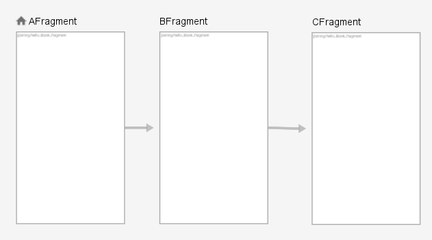
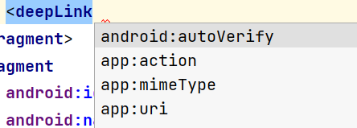
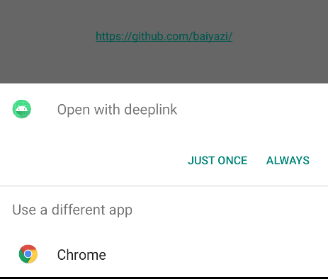
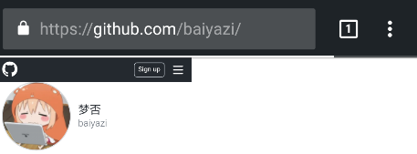

[TOC]
# 1. 前言
`Navigation`中的`DeepLink`又叫做深层链接。在 `Android` 中，深层链接是指：
>将用户直接转到应用内特定目的地的链接。

在日常生活中很容易看见的应用：微信消息通知，点击后直接进入某人或者群聊的界面。借助 `Navigation` 组件可以比较轻松的完成这个效果。在`Navigation` 组件中根据其使用方式的不同，可以分为两种不同类型的深层链接：**显式深层链接**和**隐式深层链接**。其分类如下面表格所示：
|   深层链接  |  说明   |
| --- | --- |
| **显式**深层链接  |  使用 `PendingIntent` 将用户转到应用内的特定位置。   |
|  **隐式**深层链接  | 通过 `URI`、`intent`操作和 `MIME`类型匹配深层链接。可以为单个深层链接指定多个匹配类型，但请注意，匹配的优先顺序依次是 `URI` 参数、`intent`操作和 `MIME` 类型。  |

从上面的表格中不难看出，深层链接类似于`Activity`的显式和隐式跳转逻辑。在本小节中将对**显式深层链接**和**隐式深层链接**分别进行实践理解。

# 2. 显式深层链接
## 2.1 环境
首先还是引入`navigation`、`viewmodel`和`livedata`的依赖：
~~~
// navigation
def nav_version = "2.4.2"
implementation("androidx.navigation:navigation-fragment-ktx:$nav_version")
implementation("androidx.navigation:navigation-ui-ktx:$nav_version")

// https://mvnrepository.com/
implementation 'androidx.lifecycle:lifecycle-viewmodel:2.3.1'
implementation 'androidx.lifecycle:lifecycle-livedata:2.3.1'
~~~
对应的，在`res`目录下，创建一个`navigation`类型的`xml`配置文件（`nav_graph.xml`）。然后添加`AFragment`、`BFragment`、`CFragment`三个页面，并配置在`nav_graph.xml`中的行为动作为：

然后，添加返回按钮的支持。即在`MainActivity`的`xml`布局文件中添加：
~~~
app:defaultNavHost="true"
~~~
然后在`Activity`中通过`NavigationUI`配置显示，最后重写`onSupportNavigationUp`方法。
~~~kotlin
    ...
    navController = this.findNavController(R.id.fragmentContainerView)
    NavigationUI.setupActionBarWithNavController(this, navController)
}

override fun onSupportNavigateUp(): Boolean {
    return navController.navigateUp() || super.onSupportNavigateUp()
}
~~~
然后对应的为每个`Fragment`的`TextView`添加到下个页面的点击事件。类似于这种：
~~~kotlin
override fun onViewCreated(view: View, savedInstanceState: Bundle?) {
    super.onViewCreated(view, savedInstanceState)
    view.findViewById<TextView>(R.id.a_fargment_textview).setOnClickListener {
        Navigation.findNavController(view)
            .navigate(R.id.action_AFragment_to_BFragment)
    }
}
~~~
至此，环境配置完成。

## 2.2 使用DeepLink
上面的环境配置完毕后，可以达到的效果为`AFragment`点击文本后可以进入`BFragment`，点击文本后进入`CFragment`。那么这里来测试一下，为`AFragment`添加一个按钮，可以直接进入到`CFragment`。

前文提到了，显式深层链接是深层链接的一个实例，该实例使用 `PendingIntent `将用户转到应用内的特定位置。所以这里我们需要构建`PendingIntent `对象。注意到创建深层链接有两种方式：
* 使用 `NavController.createDeepLink() `创建深层链接。
* 使用 `NavDeepLinkBuilder` 类构造深层链接。

### 2.2.1 NavController.createDeepLink()
通过`NavController`实例对象来创建一个`DeepLink`，进而可以得到`PendingIntent`对象。
~~~kotlin
// 设置PendingIntent
val pendingIntent: PendingIntent = this.findNavController().createDeepLink()
    .setGraph(R.navigation.nav_graph)  // 指定导航图
    .setDestination(R.id.CFragment) // 去往CFragment
    .setComponentName(MainActivity::class.java) // 指定Fragment所在的Activity
    .setArguments(Bundle().apply {   // 传递参数
        putString("Key", "Value")
    })
    .createPendingIntent()
~~~
### 2.2.2 NavDeepLinkBuilder(context)
~~~kotlin
// 设置PendingIntent
val pendingIntent: PendingIntent = NavDeepLinkBuilder(requireContext())
    .addDestination(R.id.CFragment, Bundle().apply { // 传递参数
        putString("Key", "Value")
    })
    .setGraph(R.navigation.nav_graph)  // 指定导航图
    .setComponentName(MainActivity::class.java) // 指定Fragment所在的Activity
    .createPendingIntent()
~~~

### 2.2.3 完整案例
在`AFragment`中点击按钮创建一个通知，然后在通知中使用`DeepLink`：
~~~kotlin
class AFragment : Fragment() {

    override fun onCreateView(
        inflater: LayoutInflater, container: ViewGroup?,
        savedInstanceState: Bundle?
    ): View? {
        return inflater.inflate(R.layout.fragment_a, container, false)
    }

    override fun onViewCreated(view: View, savedInstanceState: Bundle?) {
        super.onViewCreated(view, savedInstanceState)
        view.findViewById<TextView>(R.id.a_fargment_textview).setOnClickListener {
            Navigation.findNavController(view)
                .navigate(R.id.action_AFragment_to_BFragment)
        }
        // 使用参数
        if(arguments != null) {
            Log.e("TAG", "onViewCreated: ${ requireArguments().getString("Key") }", )
        }

        view.findViewById<Button>(R.id.a_fragment_button).setOnClickListener {
            // 使用显式深层链接
            useExplicitDeepLink()
        }
    }

    private var notificationId = 0

    private fun useExplicitDeepLink(){
        // 设置PendingIntent
        val pendingIntent: PendingIntent = this.findNavController().createDeepLink()
            .setGraph(R.navigation.nav_graph)
            .setDestination(R.id.CFragment) // 去往CFragment
            .setComponentName(MainActivity::class.java)
            .setArguments(Bundle().apply {
                putString("Key", "Value")
            })
            .createPendingIntent()
        // 创建通知
        if(Build.VERSION.SDK_INT >= Build.VERSION_CODES.O) {
            // 创建一个通知渠道
            val notificationChannel = NotificationChannel(
                activity?.packageName,
                "MyChannel",
                NotificationManager.IMPORTANCE_DEFAULT
            )
            notificationChannel.description = "显式深层链接测试"
            val notificationManager: NotificationManager? = activity?.getSystemService(NotificationManager::class.java)
            notificationManager?.createNotificationChannel(notificationChannel)
        }

        // 创建Notification
        val notification = NotificationCompat.Builder(
            requireActivity(),
            requireActivity().packageName)
            .setContentTitle("DeepLink")
            .setContentText("深层链接测试")
            .setSmallIcon(R.drawable.ic_launcher_background)
            .setPriority(NotificationCompat.PRIORITY_DEFAULT)
            .setContentIntent(pendingIntent)
            .setAutoCancel(true)
            .build()

        val notificationManagerCompat = NotificationManagerCompat.from(requireActivity())
        notificationManagerCompat.notify(notificationId++, notification)
    }
}
~~~
上面所使用的为第一种创建方式，使用`NavController`实例来进行创建一个`DeepLink`进而创建出所需的`PendingIntent`实例对象。然后将其添加到通知中。当然，也可以使用第二种方式来替换`pendingIntent`，效果一致，这里不再演示。注意到，在上面的代码中传递了参数，所以可以在目标`CFragment`中获取，即：
~~~kotlin
override fun onCreate(savedInstanceState: Bundle?) {
    super.onCreate(savedInstanceState)
    // 获取传递的数据
    val string = arguments?.getString("Key").toString()
    Log.e("TAG", "onCreate: ${string}")
}
~~~
# 3. 隐式深层链接
在前言中提到了，隐式深层链接是通过 `URI`、`intent`操作和 `MIME`类型匹配深层链接。在实际场景中比如手机浏览网页上的博客，会有“APP打开”的字样用来引导用户使用目标`App`。如果当前手机并没有安装，会引导至应用市场下载，否则直接打开这个目标应用。而这个功能，就可以使用隐式深层链接。
## 3.1 配置nav_graph.xml
首先配置一下导航图，为目标`Fragment`配置`deeplink`，支持如下配置：

由于`uri`、`action`、`mimeType`可以三选一，故而这里我仅配置了`uri`方式，如下：
~~~xml
<fragment
    android:id="@+id/CFragment"
    android:name="com.weizu.deeplink.fragments.CFragment"
    android:label="fragment_c"
    tools:layout="@layout/fragment_c">
    <deepLink app:uri="https://github.com/baiyazi/"/>
</fragment>
~~~
需要注意的是，这里需要指定`https://`或者`http://`，后面链接需要加`/`。然后可以通过两种方式来使用这个隐式深层链接。

## 3.2 配置声明
需要在应用的`manifest.xml`文件中添加内容。将一个`<nav-graph>`元素添加到指向现有导航图的 `Activity`，如以下示例所示：
~~~xml
<activity
    android:name=".MainActivity"
    android:exported="true">
    <intent-filter>
        <action android:name="android.intent.action.MAIN" />

        <category android:name="android.intent.category.LAUNCHER" />
    </intent-filter>
    <nav-graph android:value="@navigation/nav_graph"/>
</activity>
~~~
构建项目时，`Navigation` 组件会将`<nav-graph>`元素替换为生成的`<intent-filter>`元素，以匹配导航图中的所有深层链接。

## 3.3 调用
前面提到了，可以有两种方式来启用这个隐式深层链接，分别为应用内、应用外。
### 3.3.1 应用内使用
也就是同一个应用内。比如在`BFragment`添加一个`Button`然后为其添加跳转的响应：
~~~kotlin
view.findViewById<Button>(R.id.b_fragment_button).setOnClickListener {
    // 应用内使用DeepLink。
    val request = NavDeepLinkRequest.Builder
        .fromUri("https://github.com/baiyazi/".toUri())
        .build()
    findNavController().navigate(request)
}
~~~
运行即可跳转到`CFragment`页面。
### 3.3.2 应用外
可以在另一个`APP`中添加一个超链接，设置链接地址为：`https://github.com/baiyazi/`。比如直接使用`TextView`指定：
~~~xml
<TextView
    android:layout_width="wrap_content"
    android:layout_height="wrap_content"
    android:autoLink="web"
    android:text="https://github.com/baiyazi/"
    app:layout_constraintBottom_toBottomOf="parent"
    app:layout_constraintEnd_toEndOf="@+id/homeFragment_textView"
    app:layout_constraintStart_toStartOf="parent"
    app:layout_constraintTop_toTopOf="parent" />
~~~
运行就可以看到一个可点击的链接：

测试分为两种情况：
* 1. 已经安装
当我们的`DeepLink`目标应用已经安装后，启动测试带有`https://github.com/baiyazi/`链接的应用，可以发现：

虽然是一个链接，但是我们的`DeepLink`目标应用也可以发现。打开后，就是目标`CFragment`。

* 2. 未安装
当`DeepLink`目标应用未安装，这里采用卸载后再次点击。就可以发现打开的仅是链接地址了。

所以，如果放置的是应用市场的链接，就可以引导用于下载目标应用了。

# 4. 其他
关于隐式深层链接还需要注意两点：
* 链接可以设置参数；比如：`http://www.example.com/users/{id}`与`http://www.example.com/users/4`匹配。
* `SingleTop`模式需要额外处理；使用`standard`启动模式时，Navigation 会调用[`handleDeepLink()`](https://developer.android.google.cn/reference/androidx/navigation/NavController?hl=zh-cn#handleDeepLink(android.content.Intent))来处理`Intent`中的任何显式或隐式深层链接，从而自动处理深层链接。但是，如果在使用备用`singleTop`等备选`launchMode`时重复使用了相应`Activity`，则这不会自动发生。在这种情况下，有必要在`onNewIntent()`中手动调用`handleDeepLink()`。如：
~~~kotlin
override fun onNewIntent(intent: Intent?) {
    super.onNewIntent(intent)
    navController.handleDeepLink(intent)
}
~~~

代码地址：https://github.com/baiyazi/JetpackNotes/tree/main/project/deeplink
