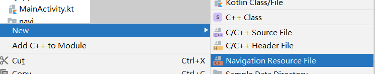
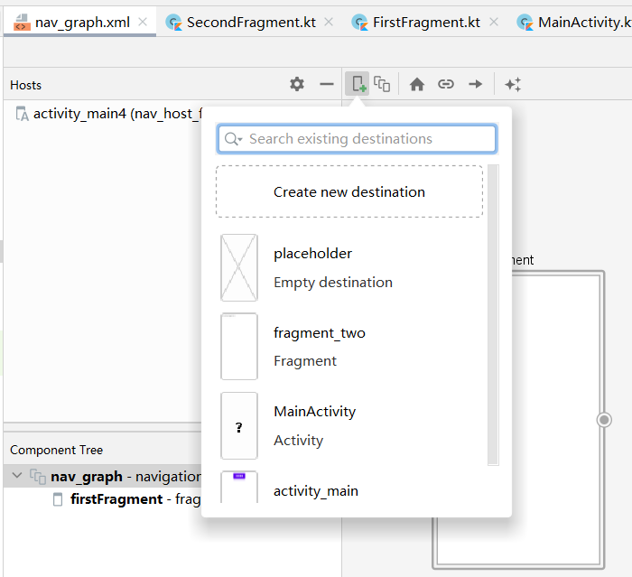
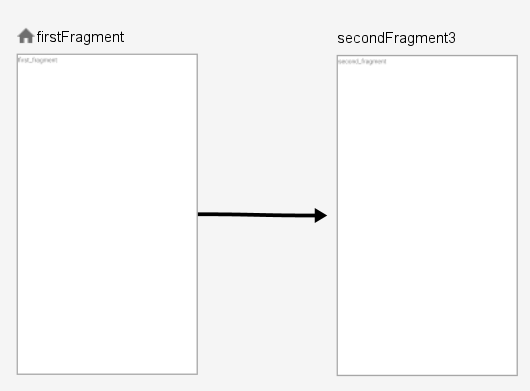
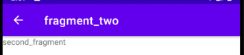
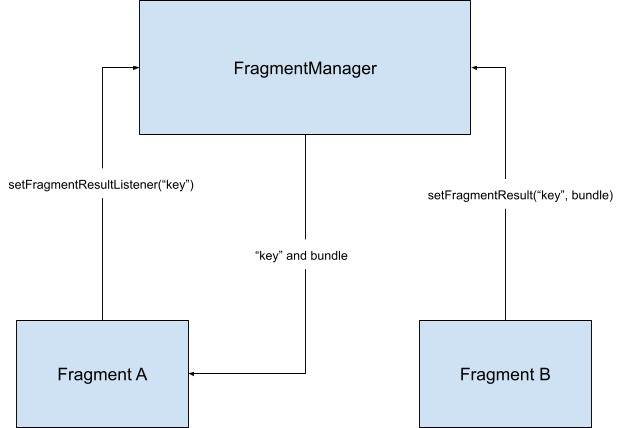
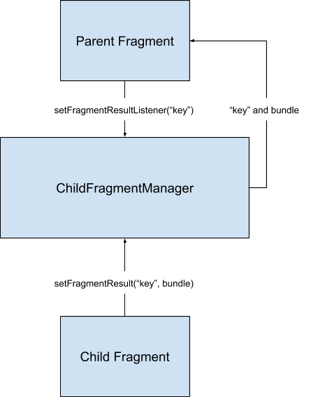

[toc]
# 1. 什么是Navigation
在`Jetpack`里有一种管理`Fragment`的新架构模式，即：单个`Activity`嵌套多个`Fragment`的`UI`架构模式。分为三个关键部分：
- 导航图：包含所有导航相关信息的 `XML` 资源，便于我们理清页面间的关系。
- `NavHostFragment`：显示导航图中目标的空白容器，可以认为是`Fragment`的容器。
- `NavController`：用于控制页面的切换工作。

# 2. 为什么引入Navigation
在之前的开发中，通常使用`FragmentManager`和`FragmentTransaction`来管理`Fragment`之间的切换。对应的一般需要完成：
> `App bar`的管理、`Fragment`间的切换动画，以及`Fragment`间的参数传递。纯代码的方式使用起来不是特别友好，并且`Fragment`和`App bar`在管理和使用的过程中显得很混乱。
> [Android Jetpack应用指南-叶坤-微信读书 (qq.com)](https://weread.qq.com/web/reader/86b3279071f02f2786bef56k1f032c402131f0e3dad99f3)

而`Jetpack`提供了一个名为`Navigation`的组件可以解决上述问题。可以：
* 方便添加页面切换动画。
* 通过`NavigationUI`类，对菜单、底部导航、抽屉菜单导航进行统一的管理。
* 页面间类型安全的参数传递。
* 支持深层链接`DeepLink`。
*   包括导航界面模式（例如抽屉式导航栏和底部导航），用户只需完成极少的额外工作。
*   `ViewModel`支持 - 您可以将`ViewModel`的范围限定为导航图，以在图表的目标之间共享与界面相关的数据。

**注意**：如果要使用导航，则必须使用[Android Studio 3.3 或更高版本](https://developer.android.google.cn/studio?hl=zh-cn)。
# 3. 简单使用
## 3.1 环境
引入依赖：
~~~
def nav_version = "2.4.2"
implementation("androidx.navigation:navigation-fragment-ktx:$nav_version")
implementation("androidx.navigation:navigation-ui-ktx:$nav_version")
~~~
在`res`目录下创建`navigation`目录：

然后新建一个`nav_graph.xml`文件：

## 3.2 布局文件
~~~xml
<?xml version="1.0" encoding="utf-8"?>
<androidx.constraintlayout.widget.ConstraintLayout
    xmlns:android="http://schemas.android.com/apk/res/android"
    xmlns:app="http://schemas.android.com/apk/res-auto"
    xmlns:tools="http://schemas.android.com/tools"
    android:layout_width="match_parent"
    android:layout_height="match_parent"
    tools:context=".navi.MainActivity">

    <fragment
        android:id="@+id/nav_host_fragment_container"
        android:name="androidx.navigation.fragment.NavHostFragment"
        android:layout_width="match_parent"
        android:layout_height="match_parent"
        app:defaultNavHost="true"
        app:navGraph="@navigation/nav_graph" />

</androidx.constraintlayout.widget.ConstraintLayout>
~~~
* 使用`android:name`告诉系统，这是一个特殊的`Fragment`。
* `app:defaultNavHost`属性设置为`true`，则该`Fragment`会自动处理系统返回键（设置为`true`后`NavHostFragment`会拦截系统返回按钮）。
* `app:navGraph`用于指定导航图。

为了测试，这里新建两个`fragment`页面。然后在`nav_graph.xml`可视化界面配置`fragment`页面之间的链接关系。如果`navigation`的可视化界面一直加载，可以尝试清理一下`AS`的缓存，即：`File -> Invalidate Caches/Restart`。然后点击加号进行添加刚添加的`Fragemnt`：

然后通过拖拽的方式添加`action`：

在`xml`文件中，可以看见：
~~~xml
<fragment
    android:id="@+id/firstFragment"
    android:name="com.weizu.myapplication.navi.fragments.FirstFragment"
    android:label="fragment_first"
    tools:layout="@layout/fragment_first" >
    <action
        android:id="@+id/action_firstFragment_to_secondFragment3"
        app:destination="@id/secondFragment3" />
</fragment>
<fragment
    android:id="@+id/secondFragment3"
    android:name="com.weizu.myapplication.navi.fragments.SecondFragment"
    android:label="fragment_two"
    tools:layout="@layout/fragment_two" />
~~~

对应的新增了一个`action`，并且指定了目的地为`secondFragment3`。
## 3.3 处理逻辑
然后在`FirstFragment`添加点击事件，为了方便这里使用`ViewBinding`来完成控件的查找。并设置对应的跳转，比如：
~~~kotlin
class FirstFragment : Fragment() {
    override fun onCreateView(
        inflater: LayoutInflater, container: ViewGroup?,
        savedInstanceState: Bundle?
    ): View {
        val binding = FragmentFirstBinding.inflate(inflater, container, false)
        binding.textView.setOnClickListener {
            // 使用NavController
            Navigation.findNavController(it)
                .navigate(R.id.action_firstFragment_to_secondFragment3)
        }
        return binding.root
    }
}
~~~
来完成跳转。然后可以设置在`ActionBar`自动添加返回箭头。

## 3.4 ActionBar返回箭头
只需要在`MainActivity `配置`NavigationUI.setupActionBarWithNavController`即可：

~~~
class MainActivity : AppCompatActivity() {
    override fun onCreate(savedInstanceState: Bundle?) {
        super.onCreate(savedInstanceState)
        setContentView(R.layout.activity_main4)

        val navController = Navigation.findNavController(this, R.id.nav_host_fragment_container)
        // 添加后才会在Action有对应的向上返回箭头图标
        NavigationUI.setupActionBarWithNavController(this, navController)
    }
}
~~~
结果：

## 3.5 返回键设置事件
注意到在3.4中只是显示了这个返回箭头，但是点击后没有事件响应。这里需要做一个处理，通过`NavController`来实现，需要在`Activity`中复写`onSupportNavigateUp`方法，比如下面的实现：
~~~kotlin
class MainActivity : AppCompatActivity() {

    private lateinit var navController: NavController

    override fun onCreate(savedInstanceState: Bundle?) {
        super.onCreate(savedInstanceState)
        setContentView(R.layout.activity_main4)

        navController = Navigation.findNavController(this, R.id.nav_host_fragment_container)
        // 添加后才会在Action有对应的向上返回箭头图标
        NavigationUI.setupActionBarWithNavController(this, navController)
    }

    // 响应返回箭头
    override fun onSupportNavigateUp(): Boolean {
        return navController.navigateUp()
    }
}
~~~
添加后，返回按键就可以响应事件。

# 4. 导航到目的地
在前面我们已经使用了`NavController`来完成导航到目的地的操作。事实上`Kotlin`中可以使用六种方式来获取`NavController`：
## 导航方式一: Navigation.findNavController(View)
~~~kotlin
binding.textView.setOnClickListener {
    //导航方式一: Navigation.findNavController(View)
    Navigation.findNavController(it)
        .navigate(R.id.action_firstFragment_to_secondFragment3)
}
~~~
## 导航方式二: Fragment.findNavController()
~~~kotlin
binding.textView.setOnClickListener {
    // 方式二: Fragment.findNavController()
    this@FirstFragment.findNavController()
        .navigate(R.id.action_firstFragment_to_secondFragment3)
}
~~~
## 导航方式三: View.findNavController()
~~~kotlin
binding.textView.setOnClickListener {
    // 方式三: View.findNavController()
    it.findNavController()
        .navigate(R.id.action_firstFragment_to_secondFragment3)
}
~~~
## 导航方式四: Activity.findNavController(viewId: Int)
~~~kotlin
binding.textView.setOnClickListener {
    // 方式四: Activity.findNavController(viewId: Int)
    // nav_host_fragment_container 为NavHostFragment容器
    activity?.findNavController(R.id.nav_host_fragment_container)
        ?.navigate(R.id.action_firstFragment_to_secondFragment3)
}
~~~
## 导航方式五：NavHostFragment.findNavController(Fragment)
~~~kotlin
binding.textView.setOnClickListener {
    // 方式五：NavHostFragment.findNavController(Fragment)
    // NavHostFragment中注册了navigation controller作为根，故而可以找到
    NavHostFragment.findNavController(this)
        .navigate(R.id.action_firstFragment_to_secondFragment3)
}
~~~
## 导航方式六：Navigation.findNavController(Activity, @IdRes int viewId)
~~~kotlin
binding.textView.setOnClickListener {
    // 方式六：Navigation.findNavController(Activity, @IdRes int viewId)
    activity?.let { it1 ->
        Navigation.findNavController(it1, R.id.nav_host_fragment_container)
            .navigate(R.id.action_firstFragment_to_secondFragment3)
    }
}
~~~
# 5. 参数传递Sage Args
这里回顾一下之前非`Jetpack`开发中是如何来实现多个`Fragment`之间的参数传递的：
## 5.1 静态添加的fragment
如果`Activity`中`fragment`比较简单，且直接使用`xml`的`android:name`来指定自定义`Fragment`页面。这种方式这里叫做**静态添加**方式。有如下解决方式：

* 直接在`Activity`中获取的`Fragment`实例（`findViewById`）然后将`Activity`作为中转进行传递参数。
* 类似的，也可以在`Fragemnt`中获取`activity`对象，然后通过`findViewById`来找到其余的`fragment`实例，然后进行操作，本质上来说和第一种一样，只是将操作数据代码放置在了自定义`Fragment`之中。
* 还可以定义接口，然后在`Activity`中设置接口的实例。

可以看出这些方式均是通过`Activity`这个中间人来进行完成的参数传递。这种做法的明显缺点就是代码耦合度比较高，因此不怎么适用。

## 5.2 动态添加的fragment
在前面提到了，在`Android`中对`Fragment`的管理通常使用`FragmentManager`和`FragmentTransaction`来管理`Fragment`之间的切换。那么在这种方式下的`Fragment`之间参数传递是如何完成的？这里也来回顾一下，参考文档：[在 Fragment 之间传递数据  |  Android 开发者  |  Android Developers (google.cn)](https://developer.android.google.cn/training/basics/fragments/pass-data-between?hl=zh-cn)。

按照文档描述可以分为两类：
|   平级  | 父子级    |
| --- | --- |
| 数据从`Fragment B` 发送到 `Fragment A` |子级 `Fragment` 发送数据到其父级 `Fragment`|
|     |     |

### 5.2.1 平级
从 `Fragment 1.3.0-alpha04` 开始，每个` FragmentManager `都会实现 `FragmentResultOwner`。这意味着 `FragmentManager `可以充当` Fragment `结果的集中存储区。此更改通过设置 `Fragment `结果并监听这些结果，而不要求 `Fragment `直接引用彼此，让单独的 `Fragment `相互通信。

假定此时需要`AFragment`和`BFragment`通讯，那么需要在`AFragment`中找到`FragmentManager`对象，然后通过`setFragmentResult`传递一个`Bundle`对象。这里需要使用相同的`requestKey`在同一`FragmentManager`上设置结果。

首先是发送数据：
~~~kotlin
class AFragment : Fragment() {

    private var listener: SwitchListener? = null

    override fun onCreateView(
        inflater: LayoutInflater, container: ViewGroup?,
        savedInstanceState: Bundle?
    ): View? {
        return inflater.inflate(R.layout.fragment_a, container, false)
    }

    override fun onResume() {
        super.onResume()
        view?.findViewById<TextView>(R.id.a_fragment_textView)?.setOnClickListener {
            Snackbar.make(it, "正在切换到BFragment", Snackbar.LENGTH_LONG)
                .show()
            // 回调函数
            listener?.onClick()
            // 传递数据到BFragment
            parentFragmentManager.setFragmentResult("requestKey", Bundle().apply {
                putString("bundleKey", "value")
            })
        }
    }

    fun setSwitchListener(l: SwitchListener){
        listener = l
    }
}
~~~
然后在`BFragment`中接收：
~~~kotlin
class BFragment : Fragment() {

    override fun onCreateView(
        inflater: LayoutInflater, container: ViewGroup?,
        savedInstanceState: Bundle?
    ): View? {
        return inflater.inflate(R.layout.fragment_b, container, false)
    }

    override fun onCreate(savedInstanceState: Bundle?) {
        super.onCreate(savedInstanceState)

        parentFragmentManager.setFragmentResultListener(
            "requestKey",
            this,
            object : FragmentResultListener{
                override fun onFragmentResult(requestKey: String, result: Bundle) {
                    view?.let {
                        val string = result.getString("bundleKey")
                        Snackbar.make(it, "BFragment收到数据内容：${ string }", Snackbar.LENGTH_LONG)
                            .show()
                    }
                }
            }
        )
    }
}
~~~
至于`Activity`中就是完成切换`Fragment`，核心为：
~~~kotlin
supportFragmentManager.beginTransaction()
    .add(R.id.fragment_container, aFragment)
    .add(R.id.fragment_container, bFragment)
    .hide(bFragment)
    .show(aFragment)
    .commit()
~~~
最终就可以做到将数据从`AFragment`传递到`BFragment`。

### 5.2.2 父子级
如需将结果从子级 `Fragment` 传递到父级 `Fragment`，父级 `Fragment `在调用`setFragmentResultListener()`时应使用`getChildFragmentManager()`而不是`getParentFragmentManager()`。
孩子传递数据：
~~~kotlin
Bundle result = new Bundle();
result.putString("bundleKey", "result");
// The child fragment needs to still set the result on its parent fragment manager
getParentFragmentManager().setFragmentResult("requestKey", result);
~~~
父`Fragment` 接收：
~~~kotlin
@Override
public void onCreate(@Nullable Bundle savedInstanceState) {
    super.onCreate(savedInstanceState);
    // We set the listener on the child fragmentManager
    getChildFragmentManager().setFragmentResultListener("key", this, new FragmentResultListener() {
        @Override
        public void onFragmentResult(@NonNull String key, @NonNull Bundle bundle) {
            String result = bundle.getString("bundleKey");
            // Do something with the result..
        }
    });
}
~~~
## 5.3 其余方式
比如`EventBus`、`ViewModel`、文件等方式。当然，在`NavController`中也提供了一个可传递普通对象的方法：
~~~kotlin
navigate(@IdRes resId: Int, args: Bundle?)
~~~
也可以用于参数的传递。
## 5.4 Navigation的Safe Args
参考文档：[在目的地之间传递数据  |  Android 开发者  |  Android Developers (google.cn)](https://developer.android.google.cn/guide/navigation/navigation-pass-data?hl=zh-cn)

值得注意的是，文档提到了：
> 通常情况下，强烈建议您仅在目的地之间**传递最少量的数据**。例如，您应该传递键来检索对象而不是传递对象本身，因为在` Android `上用于保存所有状态的总空间是有限的。如果您需要传递大量数据，不妨考虑使用 `ViewModel`（如在 `Fragment `之间共享数据中所述）。

也即是：其实`Safe Args`比较鸡肋。

### 5.4.1 环境配置
在项目的`build.gradle`文件中配置：
~~~
buildscript {
    repositories {
        google()
    }
    dependencies {
        val nav_version = "2.4.2"
        classpath("androidx.navigation:navigation-safe-args-gradle-plugin:$nav_version")
    }
}
~~~
以及在`app`模块中添加：
~~~
plugins {
    ...
    id "androidx.navigation.safeargs"
}
~~~
启用 `Safe Args `后，该插件会生成代码，其中包含您定义的每个操作的类和方法。对于每个操作，Safe Args 还会为每个源目的地（生成相应操作的目的地）生成一个类。生成的类的名称由源目的地类的名称和“Directions”一词组成。例如，如果目的地的名称为`SpecifyAmountFragment`，生成的类的名称为`SpecifyAmountFragmentDirections`。生成的类为源目的地中定义的每个操作提供了一个静态方法。该方法会将任何定义的操作参数作为参数，并返回可传递到`navigate()`的`NavDirections`对象。

### 5.4.2 使用
比如在`nav_graph.xml`中配置一个`username`参数：
~~~xml
<fragment
    android:id="@+id/firstFragment"
    android:name="com.weizu.myapplication.navi.fragments.FirstFragment"
    android:label="fragment_first"
    tools:layout="@layout/fragment_first" >
    <action
        android:id="@+id/action_firstFragment_to_secondFragment3"
        app:destination="@id/secondFragment3"
        app:enterAnim="@android:anim/slide_in_left"
        app:exitAnim="@android:anim/slide_out_right"
        >
 <!--定义参数-->
    <argument
        android:name="user_name"
        app:argType="string"
        android:defaultValue="张三"
        />
</action>
   
</fragment>
~~~
注意到`argument`定义在`action`标签下，故而在导航的时候，是通过`action`来封装和赋值。比如在源`Fragment`中传递：
~~~
binding.textView.setOnClickListener {
    // 方式六：Navigation.findNavController(Activity, @IdRes int viewId)
    activity?.let { it1 ->
//                Navigation.findNavController(it1, R.id.nav_host_fragment_container)
//                    .navigate(R.id.action_firstFragment_to_secondFragment3)

        val action: NavDirections =
            FirstFragmentDirections.actionFirstFragmentToSecondFragment3("李思思")
        view?.findNavController()?.navigate(action)
    }
}
~~~
在目标`Fragment`中，直接获取即可：
~~~
override fun onViewCreated(view: View, savedInstanceState: Bundle?) {
    super.onViewCreated(view, savedInstanceState)

    val string = arguments?.getString("user_name")
    Snackbar.make(view, "${ string }", Snackbar.LENGTH_LONG)
        .show()
}
~~~
但其实这个过程和`Bundle`类似。

# 5. 后
由于篇幅原因，拟将接下来的内容放置到下个小节中继续。

