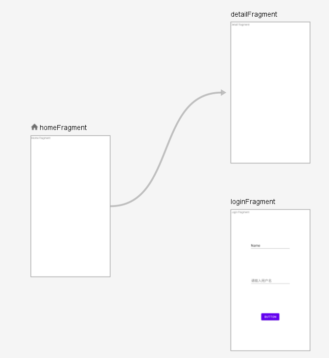

[toc]
# 1. 前言
拟定在本小节完成[条件导航](https://developer.android.google.cn/guide/navigation/navigation-conditional?hl=zh_cn)案例。具体逻辑就是：
* 一共三个`Fragment`，分别为游客可查看的主页、需要登录后才可查看的详情、以及登录页面。
* 用户进入主页后，如果点击了跳转到详情页面，就判断用户是否登录。如果没有登录进入登录页面，否则显示详情页面数据。
* 具体使用技术为`Navigation`、`ViewModel`、`LiveData`。

注：这里用户的登录为模拟，没有请求后台，直接在`ViewModel`中判断完成。

# 2. 实现
## 2.1 基础配置
在`nav_graph.xml`导航图文件中指定主页和详情页的逻辑跳转关系，如下图：

并在`nav_graph.xml`中指定开始的目标为`homeFragment`：
~~~
<navigation xmlns:android="http://schemas.android.com/apk/res/android"
    ...
    app:startDestination="@id/homeFragment">
~~~
在`MainActvity`的布局文件中使用`ConstraintLayout`，并定义一个`Fragment`的容器，指定为`NavHostFragment`类型，即：
~~~
<fragment
    android:id="@+id/fragmentContainerView"
    android:name="androidx.navigation.fragment.NavHostFragment"
    android:layout_width="match_parent"
    android:layout_height="match_parent"
    app:defaultNavHost="true"
    app:navGraph="@navigation/nav_graph" />
~~~

并指定`app:defaultNavHost`属性为`true`，表示`NavHostFragment`会拦截系统返回按钮；用`app:navGraph`属性指定导航图文件。为了在能够拦截返回键，这里需要在`MainActivity`中完成下面两步：
* 通过`NavigationUI`来设置拦截的系统返回箭头显示；
* 通过复写`onSupportNavigationUp`来响应用户点击事件；

代码如下：
~~~
class MainActivity : AppCompatActivity() {

    // NavController对象
    private lateinit var navController: NavController

    override fun onCreate(savedInstanceState: Bundle?) {
        super.onCreate(savedInstanceState)
        setContentView(R.layout.activity_main)
        // 1. 通过NavigationUI来设置显示返回箭头
        navController =
            Navigation.findNavController(this, R.id.fragmentContainerView)
        NavigationUI.setupActionBarWithNavController(this, navController)
    }

    // 2. 复写onSupportNavigateUp
    override fun onSupportNavigateUp(): Boolean {
        return  navController.navigateUp()
    }
}
~~~
## 2.2 页面逻辑
分为三个`Fragment`页面，首先是在`HomeFragment`中完成点击后跳转到`DetailFragment`的监听：
~~~kotlin
// HomeFragment
override fun onViewCreated(view: View, savedInstanceState: Bundle?) {
    super.onViewCreated(view, savedInstanceState)
    val textView = view.findViewById<TextView>(R.id.homeFragment_textView)

    textView.setOnClickListener {
        this.findNavController().navigate(R.id.detailFragment)
    }
}
~~~
在`DetailFragment`中完成用户登录的判断。这里的逻辑为：
* 使用`ViewModel`来存储一个`LiveData`类型的用户对象，进入的时候初始化内容为游客，并且对于这个用户数据类型的`LiveData`类型注册一个观察。如果当前`ViewModel`中存储的用户为游客，就跳转向登录页面；
* 获取当前返回栈的实例，从中获取`SavedStateHandle`，这个对象用于键值对的形式存储数据，在`get`和`set`的时候可以用于设置一个可观察的`LiveData`。

在`LoginFragment`中完成用户登录的判断。逻辑为：
* 和`DetailFragment`使用同一个`ViewModel`，在这个`ViewModel`中添加一个用来存储登录成功或失败的变量，登录成功后，更新用户`User`以及对应的登录成功与否的标志。
* 在`LoginFragment`中注册登录成功与否标志的观察者，如果登录成功，在栈中上一个实例的`SavedStateHandle`中存储登录成功标志为`true`。并回退栈。

## 2.3 代码
### 2.3.1 UserModel
存储两个变量，分别为用户和登录成功与否标志：
~~~kotlin
class UserViewModel : ViewModel() {
    var user = MutableLiveData<User>()
    var loginResult = MutableLiveData<LoginResult>()

    fun login(username: String, password: String){
        val flag = (username == "Name" && password == "123")
        if(flag) { // 相等在写入
            user.value = User(username, password)
        }
        loginResult.value = LoginResult(flag)
        Log.e("TAG", "login: $flag")
    }

    fun initUser(){
        user.value = User("游客", "123")
    }
}
~~~
### 2.3.2 LoginFragment
调用`ViewModel`中的登录判断，注册观察者观察登录成功与否标志。然后根据逻辑完成添加标志以及回退。
~~~kotlin
class LoginFragment : Fragment() {

    override fun onCreateView(
        inflater: LayoutInflater, container: ViewGroup?,
        savedInstanceState: Bundle?
    ): View? {
        return inflater.inflate(R.layout.fragment_login, container, false)
    }

    private lateinit var userViewModel: UserViewModel
    private var savedStateHandle: SavedStateHandle? = null

    companion object {
        const val LOGIN_SUCCESSFUL = "LOGIN_SUCCESSFUL"
    }

    override fun onViewCreated(view: View, savedInstanceState: Bundle?) {
        super.onViewCreated(view, savedInstanceState)
        userViewModel = ViewModelProvider(requireActivity(), ViewModelProvider.NewInstanceFactory())
            .get(UserViewModel::class.java)
        // 检索上一个目的地的NavBackStackEntry
        savedStateHandle = Navigation.findNavController(view)
            .previousBackStackEntry
            ?.savedStateHandle
        // 初始时刻，设置登录状态为false
        savedStateHandle?.set(LOGIN_SUCCESSFUL, false)

        // 获取用户输入的数据
        val userName = view.findViewById<EditText>(R.id.editTextTextPersonName)
        val password = view.findViewById<EditText>(R.id.editTextTextPassword)
        val submit = view.findViewById<Button>(R.id.submit)

        submit.setOnClickListener {
            login(userName.text.toString(), password.text.toString())
        }

        userViewModel.loginResult.observe(viewLifecycleOwner) {
            Log.e("TAG", "onViewCreated: 哈哈哈 ${ it?.success }" )
            if (it?.success == true) {
                savedStateHandle?.set(LOGIN_SUCCESSFUL, true);
                NavHostFragment.findNavController(this@LoginFragment).popBackStack()
                Snackbar.make(view, "登录成功", Snackbar.LENGTH_LONG)
                    .show()
            } else {
                Snackbar.make(view, "登录失败", Snackbar.LENGTH_LONG)
                    .show()
            }
        }
    }

    private fun login(userName: String, passWord: String){
        userViewModel.login(userName, passWord)
    }
}
~~~
 ### 2.3.3 DetailFragment
~~~kotlin
class DetailFragment : Fragment() {

    private lateinit var userViewModel: UserViewModel

    override fun onCreateView(
        inflater: LayoutInflater, container: ViewGroup?,
        savedInstanceState: Bundle?
    ): View? {
        return inflater.inflate(R.layout.fragment_detail, container, false)
    }

    override fun onCreate(savedInstanceState: Bundle?) {
        super.onCreate(savedInstanceState)
        // 可能是登录后的回退到这个页面
        Log.e("TAG", "onCreate: 可能是登录后的回退到这个页面", )
        val navController = NavHostFragment.findNavController(this)
        // 检索当前的nav
        val currentBackStackEntry = navController.currentBackStackEntry
        val savedStateHandle = currentBackStackEntry?.savedStateHandle
        if (currentBackStackEntry != null) {
            savedStateHandle?.getLiveData<Boolean>(LoginFragment.LOGIN_SUCCESSFUL)
                ?.observe(currentBackStackEntry, object : Observer<Boolean>{
                    override fun onChanged(flag: Boolean?) {
                        if(flag == true) {
                            // 登录成功
                            val startDestinationId = navController.graph.startDestinationId
                            val navOptions = NavOptions.Builder()
                                .setPopUpTo(startDestinationId, true)
                                .build()
                            navController.navigate(startDestinationId, null, navOptions)
                        } else {
                            // 登录失败，回退到游客页面
                            NavHostFragment.findNavController(this@DetailFragment).popBackStack()
                        }
                    }
                })
        }
    }

    override fun onViewCreated(view: View, savedInstanceState: Bundle?) {
        super.onViewCreated(view, savedInstanceState)
        // 判断用户信息是否为空
        userViewModel = ViewModelProvider(requireActivity(), ViewModelProvider.NewInstanceFactory())
            .get(UserViewModel::class.java)
        val findNavController = this.findNavController()

        userViewModel.user.observe(viewLifecycleOwner) {
            if (it.name == "游客") {
                findNavController.navigate(R.id.loginFragment)
            }
        }

        // 初始化一个游客身份登录
        if(userViewModel.user.value?.name == null) {
            userViewModel.initUser()
        }
    }

}
~~~

# 3. 代码地址
代码地址：https://github.com/baiyazi/JetpackNotes/tree/main/project/navi

