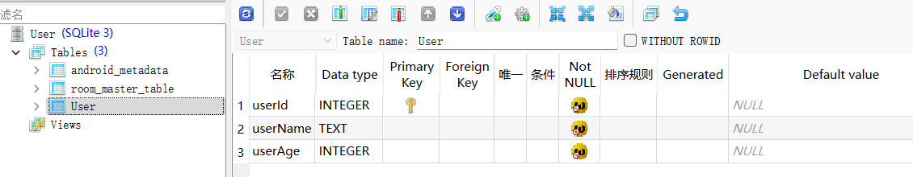

[toc]
# 1. 前言
实现内容：
- 使用`Room`框架来完成数据库的`CRUD`操作；
- 对于查询到的数据库数据，使用`LiveData`进行封装，使得每次数据库中数据更新后都可以自动渲染到`RecyclerView`控件；

# 2. 实现
最后效果：

文件结构：


## 2.1 定义Room相关的结构
`User`表：
~~~kotlin
@Entity(tableName = "User")
class User {

    @PrimaryKey(autoGenerate = true)
    @ColumnInfo(name = "userId", typeAffinity = ColumnInfo.INTEGER)
    var id = 0

    @ColumnInfo(name = "userName", typeAffinity = ColumnInfo.TEXT)
    var name = ""

    @ColumnInfo(name = "userAge", typeAffinity = ColumnInfo.INTEGER)
    var age = 10

    // 可以让创建的时候忽略这个属性
    @Ignore
    var date = "2022年4月20日20:59:20"
}
~~~
使用`@Entity`注解标识表，使用`tableName`可以定制表名。`@ColumnInfo`来指定字段，`typeAffinity`用于指定该字段在数据库中的类型。最后的`@Ignore`标签可以用来忽略不需要加入到表中的数据。


同样可以在应用目录下找到这个数据库文件。不妨使用`SQLiteStudio`打开这个数据库文件：

可以看见确实`@Ignore`标签修饰的字段没有生成。

其实和`SQLite`差不多，只是做了一层封装。使得使用起来更简洁。
然后就是定义对应的接口操作层，有点类似于`SpringBoot`中常写的`Service`层：
~~~kotlin
@Dao  // 这个注解仅用作标识
interface UserDao {

    @Insert(onConflict = OnConflictStrategy.REPLACE)
    fun insertUser(user: User): Unit

    @Delete
    fun deleteUser(user: User): Unit

    @Query("select * from User")
    fun getAllUser(): LiveData<List<User>>

    @Query("select * from User where userId = :userId")
    fun getUserById(userId: Int): User

    @Update(onConflict = OnConflictStrategy.REPLACE)
    fun updateUser(user: User)
}
~~~
上面值得注意的是其中一个方法，即：
```kotlin
@Query("select * from User")
fun getAllUser(): LiveData<List<User>>
```
在返回的数据`List<User>`可以直接使用`LiveData`来进行包起来。最后是获取数据库实例的类，这个类定义为单例，所有的数据库中表相关的`Dao`层不需要实现，声明为抽象方法，具体的实现由`Room`自动实现，所以这个类也需要声明为`abstract`：
~~~kotlin
@Database(entities = arrayOf(User::class), version = 1, exportSchema = false)
abstract class UserDataBase : RoomDatabase() {
    // 定义的抽象方法，由Room自动实现，我们不需要实现
    abstract fun userDao(): UserDao


    companion object {
        // 单例模式
        private var mInstance: UserDataBase? = null
        private const val DATABASE_NAME = "User.db"

        @JvmStatic
        fun getInstance(context: Context): UserDataBase? {
            if (mInstance == null) {
                synchronized(UserDataBase::class.java) {
                    if (mInstance == null) {
                        mInstance = createInstance(context)
                    }
                }
            }
            return mInstance
        }

        private fun createInstance(context: Context): UserDataBase {
            mInstance = Room.databaseBuilder(
                context.applicationContext,
                UserDataBase::class.java,
                DATABASE_NAME
            ).build()
            return mInstance as UserDataBase
        }
    }
}
~~~

## 1.2 定义Repository
然后定义一层`Repository`，类似于`SpringBoot`中的`Controller`层。添加这一层主要是因为在`Room`要求数据操作不能在`UI`线程中，需要在**子线程**中进行操作。且在这个类中完成获取数据库的实例对象，然后再次封装`CRUD`方法，可以在自定义`ViewModel`的类中更加简洁。
~~~kotlin
/**
 * @author 梦否 on 2022/4/20
 * @blog https://mengfou.blog.csdn.net/
 */
class UserRepository(var context: Context) {

    private var userDao: UserDao? = null

    init {
        // 获取到数据库操作的Dao层接口
        userDao = UserDataBase.getInstance(context)?.userDao()
    }

    // Android-Room要求数据操作不能在UI线程中，需要在子线程中进行操作
    fun insertUser(user: User) {
        GlobalScope.launch {
            userDao?.insertUser(user)
        }
    }

    fun deleteUserById(id: Int) {
        val user = User().apply {
            this.id = id
        }
        GlobalScope.launch {
            userDao?.deleteUser(user)
        }
    }

    fun updateUser(user:User){
        GlobalScope.launch {
            userDao?.updateUser(user)
        }
    }

    fun getAllUsers(): LiveData<List<User>>? {
        return userDao?.getAllUser()
    }
}
~~~
## 1.3 定义ViewModel
最后在`ViewModel`中共只需要完成获取所有数据即可。因为返回的是`LiveData`所以我们可以设置监听：
~~~kotlin
class UserViewModel() : ViewModel() {

    var repository: UserRepository? = null
    var context: Context? = null

    fun getUsers(): LiveData<List<User>>? {
        val allUsers = repository?.getAllUsers()
        return allUsers
    }
}
~~~
## 1.4 定义RecyclerView
在布局文件中，因为需要使用`RecyclerView`来渲染数据，所以这里首先定义一个适配器类，且在这个控件需要完成数据库中数据发生改变后就自动渲染。所以这里使用`dataBinding`来定义布局文件：
~~~xml
<layout xmlns:android="http://schemas.android.com/apk/res/android"
    xmlns:app="http://schemas.android.com/apk/res-auto"
    xmlns:tools="http://schemas.android.com/tools">

    <data>
        <variable
            name="user"
            type="com.weizu.myapplication.room.User" />
    </data>

    <androidx.constraintlayout.widget.ConstraintLayout
        android:layout_width="match_parent"
        android:layout_height="80dp">

        <TextView
            android:id="@+id/item_recyclerview_id"
            android:layout_width="wrap_content"
            android:layout_height="wrap_content"
            android:text="@{ String.valueOf(user.id) }"
            android:textSize="20sp"
            app:layout_constraintBottom_toBottomOf="parent"
            app:layout_constraintEnd_toStartOf="@+id/guideline2"
            app:layout_constraintStart_toStartOf="parent"
            app:layout_constraintTop_toTopOf="parent" />

        <androidx.constraintlayout.widget.Guideline
            android:id="@+id/guideline2"
            android:layout_width="wrap_content"
            android:layout_height="wrap_content"
            android:orientation="vertical"
            app:layout_constraintGuide_percent="0.3" />

        <androidx.constraintlayout.widget.Guideline
            android:id="@+id/guideline3"
            android:layout_width="wrap_content"
            android:layout_height="wrap_content"
            android:orientation="vertical"
            app:layout_constraintGuide_percent="0.7080292" />

        <TextView
            android:id="@+id/room_recyclerview_name"
            android:layout_width="wrap_content"
            android:layout_height="wrap_content"
            android:text="@{ user.name }"
            android:textSize="24sp"
            app:layout_constraintBottom_toBottomOf="parent"
            app:layout_constraintEnd_toEndOf="parent"
            app:layout_constraintStart_toStartOf="parent"
            app:layout_constraintTop_toTopOf="parent" />

        <TextView
            android:id="@+id/room_recyclerview_age"
            android:layout_width="wrap_content"
            android:layout_height="wrap_content"
            android:text="@{ String.valueOf(user.age) }"
            android:textSize="20sp"
            app:layout_constraintBottom_toBottomOf="parent"
            app:layout_constraintEnd_toEndOf="parent"
            app:layout_constraintStart_toStartOf="@+id/guideline3"
            app:layout_constraintTop_toTopOf="parent" />
    </androidx.constraintlayout.widget.ConstraintLayout>
</layout>
~~~
然后定义对应的适配器：

~~~kotlin
class MyRecyclerViewAdapter(val context: Context, var datas: List<User>) :
    RecyclerView.Adapter<MyRecyclerViewAdapter.MyViewHolder>() {

    fun setData(datas: List<User>) {
        this.datas = datas
    }

    override fun onCreateViewHolder(parent: ViewGroup, viewType: Int): MyViewHolder {
        val binding = DataBindingUtil.inflate<RoomRecyclerviewItemBinding>(
            LayoutInflater.from(context),
            R.layout.room_recyclerview_item,
            parent,
            false
        )
        val myViewHolder = MyViewHolder(binding.root).apply {
            this.binding = binding
        }
        return myViewHolder
    }

    override fun onBindViewHolder(holder: MyViewHolder, position: Int) {
        datas.apply {
            holder.binding?.user = datas.get(position)
        }
    }

    override fun getItemCount(): Int {
        return datas.size
    }

    inner class MyViewHolder(view: View) : RecyclerView.ViewHolder(view) {
        var binding: RoomRecyclerviewItemBinding? = null
    }
}
~~~
## 1.5 定义Activity
最后就是在`Activity`中进行使用了：
~~~kotlin
class MainActivity : AppCompatActivity() {

    private val userRepository: UserRepository by lazy {
        val userRepository = UserRepository(this)
        userRepository
    }

    override fun onCreate(savedInstanceState: Bundle?) {
        super.onCreate(savedInstanceState)
        val binding =
            DataBindingUtil.setContentView<ActivityMain2Binding>(
                this,
                R.layout.activity_main2
            )

        val myViewModel = ViewModelProvider(this, ViewModelProvider.NewInstanceFactory())
            .get(UserViewModel::class.java)

        myViewModel.context = this
        myViewModel.repository = userRepository

        val myRecyclerViewAdapter =
            MyRecyclerViewAdapter(this, userRepository.getAllUsers()?.value ?: ArrayList<User>())
        binding.recycleview.layoutManager = LinearLayoutManager(this)
        binding.recycleview.adapter = myRecyclerViewAdapter

        myViewModel.getUsers()?.observe(this) {
            myRecyclerViewAdapter.datas = it
            myRecyclerViewAdapter.notifyDataSetChanged()
            currentDatas = it
        }
    }

    private var count = 1
    private var currentDatas: List<User>? = null

    fun insert(view: View) {
        userRepository.insertUser(User().apply {
            name = "张${ count++ }"
            age = 20
        })
    }
    fun delete(view: View) {
        // 随机删除一个
        currentDatas?.let {
            if(currentDatas!!.isNotEmpty()) {
                val index = (Math.random() * currentDatas!!.size).toInt()
                currentDatas?.get(index)?.id?.let { userRepository.deleteUserById(it) }
            }
        }
    }
    fun update(view: View) {
        currentDatas?.let {
            if(currentDatas!!.isNotEmpty()) {
                // 随机修改一个用户信息
                val index = (Math.random() * currentDatas!!.size).toInt()
                currentDatas?.get(index)?.apply {
                    name = "update: ${ name }"
                    userRepository.updateUser(this)
                }
            }
        }
    }
}
~~~

至于主布局文件，比较简单这里不再给出。

