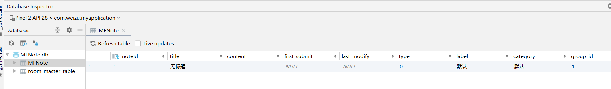
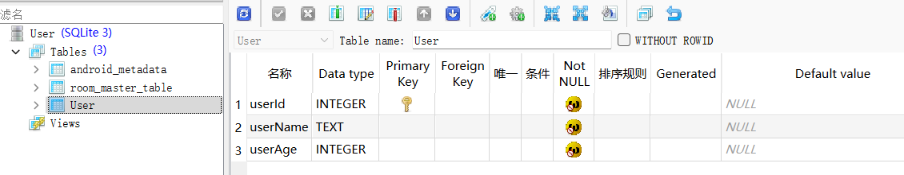
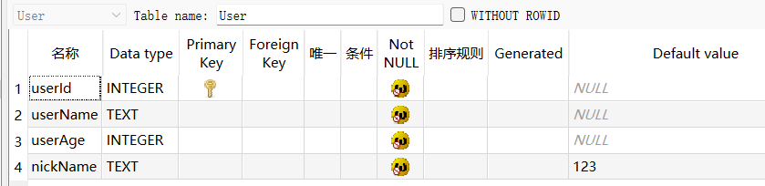
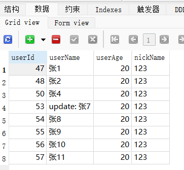
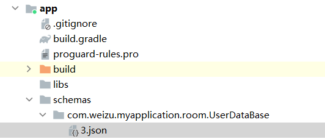

[toc]
# 1. 前言
当然，我们所使用的就是之前使用过的`SQLite`数据库。可以简单回顾一下在`java`中是如何操作数据库的：
- 继承自`SQLiteOpenHelper`类，复写对应的方法，可以得到一个`Helper`实例；
- 通过`SQLiteOpenHelper`的实例的`getWritableDatabase()`来得到一个数据库实例；
- 然后就可以通过这个数据库实例进行`CRUD`操作；

简单回顾一下在`Java`中的流程：
```
// 构建一个子类Helper
public class MySQLiteOpenHelper extends SQLiteOpenHelper {
    private Context context;
    private String name;
    private String bookSql = "create table Book (id integer primary key autoincrement, " +
            "name text, pages integer)";
    private String userSql = "create table User (name text, age integer)";

    public MySQLiteOpenHelper(@Nullable Context context,
                              @Nullable String name,
                              @Nullable SQLiteDatabase.CursorFactory factory,
                              int version) {
        super(context, name, factory, version);
        this.context = context;
        this.name = name;
    }

    @Override
    public void onCreate(SQLiteDatabase db) {
        // 创建数据库表
        db.execSQL(bookSql);
        db.execSQL(userSql);
    }

    @Override
    public void onUpgrade(SQLiteDatabase db, int oldVersion, int newVersion) {
        db.execSQL("drop table if exists Book");
        db.execSQL("drop table if exists User");
        onCreate(db); // 重新执行一下onCreate方法
    }
}

// 获取db对象
mySQLiteOpenHelper = new MySQLiteOpenHelper(getApplicationContext(),
                "BookDatabase.db", null, 3);
SQLiteDatabase db= mySQLiteOpenHelper.getWritableDatabase();


// CRUD
db.insert("Book", null, values);
```

# 2. Kotlin中的数据库操作
虽然在`Kotlin`中也可以像上面的那种方式一样来进行数据库的操作，但是`Google`推出了一款数据库框架，即：`Room`。下面就使用这个框架进行完成操作。

## 2.1 依赖
首先需要添加依赖：
~~~
// Room
def room_version = "2.2.6"
implementation "androidx.room:room-runtime:$room_version"
// For Kotlin use kapt instead of annotationProcessor (注意这个注释)
kapt "androidx.room:room-compiler:$room_version"
implementation "androidx.room:room-ktx:$room_version"
testImplementation "androidx.room:room-testing:$room_version"
~~~
当然，这里在`kotlin`中使用`kapt`，我们需要导入这个插件：
~~~
plugins {
    id 'com.android.application'
    id 'kotlin-android'
    id 'kotlin-kapt'
}
~~~
注释：如果项目是使用`Kotlin`语言来开发的，在添加`room-compiler`的时候使用`kapt`关键字，`java`语言开发的就使用`annotationProcessor`关键字。

## 2.2 基础概念
要想使用`Room`，必须要了解最基础的三个概念：

*   `Entity`：实体类，对应的是数据库的一张表结构。需要使用注解 `@Entity` 标记。默认实体类的类名为表名，字段名为数据库中的字段。
    
*   `Dao`：包含访问一系列访问数据库的方法。需要使用注解 `@Dao` 标记。
    
*   `Database`：数据库持有者，作为与应用持久化相关数据的底层连接的主要接入点。需要使用注解 `@Database` 标记。

使用`@Database`注解需满足以下条件：

*   定义的类必须是一个继承于`RoomDatabase`的抽象类。
    
*   在注解中需要定义与数据库相关联的实体类列表。
    
*   包含一个没有参数的抽象方法并且返回一个带有注解的 `@Dao`。

注释：以上基础概念摘自：[Jetpack架构组件 — Room入坑详解](https://blog.csdn.net/singwhatiwanna/article/details/104890202/)

### 2.2 1 @Entity
从前面我们知道，`@Entity`作用在类上，该类对应数据库中的一个数据表。属性对应数据库中的字段，那么类似的我们可以指定主键和注释。同样也是使用注解：

* `@PrimaryKey`注解用来标注表的主键，可以使用`autoGenerate = true `来指定了主键自增长；
*  `@ColumnInfo`注解用来标注表对应的列的信息比如表名、默认值等等。
* `@Ignore` 注解顾名思义就是忽略这个字段，使用了这个注解的字段将不会在数据库中生成对应的列信息。

### 2.2.2 @Dao
`Dao`类是一个接口，其中定义了一系列的操作数据库的方法。`Room`也为我们的提供了相关的注解，有`@Insert`、`@Delete`、`@Update` 和 `@Query`。

比如：
```
@Query("select * from user where userId = :id") 
fun getUserById(id: Long): User 
```

### 2.2.3 @Database
首先需要定义一个类，继承自`RoomDatabase`，并添加注解 `@Database` 来标识。

## 2.3 实战
这里我们需要一个数据库来存储用户记事本的数据，大致包括如下内容：
|  字段   |  说明   |
| --- | --- |
|  `title`   |  标题   |
|   `content`  |  数据内容   |
|  `firstSubmit`   |   首次提交时间  |
|   `lastModifiy`  |   最后一次修改时间  |
|  `type`   |   类型，普通记事或者待办  |
|  `label`   |   标签，支持多个，使用`#`号分割 |
|   `category`  |   分类，工作/学习/生活/...  |
|  `groupId`   |   组号，默认为1，表示单个记录；如果为多个，表示前端显示为重叠  |

那么首先我们需要使用`@Entity`注解来生成逻辑的表（`MFNote`）：

~~~
@Entity
class MFNote {
    @PrimaryKey(autoGenerate = true)
    var noteId: Int = 0

    @ColumnInfo(defaultValue = "无标题")
    lateinit var title: String

    @ColumnInfo(defaultValue = "")
    lateinit var content: String

    @ColumnInfo(name = "first_submit")
    var submit: String? = null

    @ColumnInfo(name = "last_modify")
    var modify: String? = null

    var type: Int = 0

    @ColumnInfo(defaultValue = "默认")
    lateinit var label: String


    @ColumnInfo(defaultValue = "默认")
    lateinit var category: String

    @ColumnInfo(name = "group_id")
    var groupId: Int = 1
}
~~~
然后构建一个访问`MFNote`表的`DAO`接口（`MFDao`）：
~~~
@Dao
interface MFDao {
    @Insert(onConflict = OnConflictStrategy.REPLACE)
    fun insert(mfNote: MFNote?)

    @Delete
    fun delete(mfNote: MFNote): Int

    @Query("select * from MFNote")
    fun getAllNotes(): List<MFNote>

    @Query("select * from MFNote where type = :type")
    fun getNotesByType(type: Int): MFNote

    @Update
    fun updateNoteByNote(mfNote: MFNote)
}
~~~

参数`onConflict`，表示的是当插入的数据已经存在时候的处理逻辑，有三种操作逻辑：`REPLACE`、`ABORT`和`IGNORE`。如果不指定则默认为`ABORT`终止插入数据。这里我们将其指定为`REPLACE`替换原有数据。

最后需要构建`Room`使用的入口`RoomDatabase`。

~~~
@Database(entities = [MFNote::class], version = 1)
abstract class MFNoteDataBase : RoomDatabase() {

    abstract fun mfDao(): MFDao

    companion object {
        @Volatile
        private var mInstance: MFNoteDataBase? = null
        private const val DATABASE_NAME = "MFNote.db"

        @JvmStatic
        fun getInstance(context: Context): MFNoteDataBase? {
            if (mInstance == null) {
                synchronized(MFNoteDataBase::class.java) {
                    if (mInstance == null) {
                        mInstance = createInstance(context)
                    }
                }
            }
            return mInstance
        }

        private fun createInstance(context: Context): MFNoteDataBase {
            mInstance = Room.databaseBuilder(
                context.applicationContext,
                MFNoteDataBase::class.java,
                DATABASE_NAME
            ).build()
            return mInstance as MFNoteDataBase
        }
    }
}
~~~

在这里我们只需要对一个数据库表进行操作，所以就定义了一个抽象接口。如果需要定义多个，比如下面的写法：
~~~
@Database(entities = [User::class, Course::class, Teacher::class, UserJoinCourse::class, IDCard::class], version = 1)
abstract class AppDataBase : RoomDatabase() {
    abstract fun userDao(): UserDao
    abstract fun teacherDao(): TeacherDao
    abstract fun courseDao(): CourseDao
    abstract fun userJoinCourseDao(): UserJoinCourseDao
    abstract fun idCardDao(): IDCardDao
}
~~~

*   `@Database` 表示继承自`RoomDatabase`的抽象类，`entities`指定表的实现类列表，`version`指定了`DB`版本
    
      
    
*   必须提供获取`DAO`接口的抽象方法，比如上面定义的`movieDao()`，`Room`将通过这个方法实例化`DAO`接口

接下来就是调用了：
~~~
class TestActivity : AppCompatActivity() {

    override fun onCreate(savedInstanceState: Bundle?) {
        super.onCreate(savedInstanceState)
        setContentView(R.layout.activity_test)

        // 调用Room数据库
        val mfDao = MFNoteDataBase.getInstance(this)?.mfDao()
        mfDao?.insert(MFNote())

        mfDao?.getAllNotes()?.forEach {
            Log.e("TAG", "onCreate: ${it.title}, ${it.category}" )
        }
    }
}
~~~
结果：


最终我在`Dao`层添加了如下方法：
~~~
@Dao
interface MFDao {
    @Insert(onConflict = OnConflictStrategy.REPLACE)
    fun insert(mfNote: MFNote?)

    @Delete
    fun delete(mfNote: MFNote): Int

    @Query("select * from MFNote")
    fun getAllNotes(): List<MFNote>

    @Query("select * from MFNote where noteId = :id")
    fun getNoteByNoteId(id: Int): MFNote

    @Query("select * from MFNote where type = :type")
    fun getNotesByType(type: Int): List<MFNote>

    @Query("select * from MFNote where label like '%' || :label || '%'")
    fun getNotesByLabel(label: String): List<MFNote>

    @Query("select * from MFNote where category like '%' || :category || '%'")
    fun getNotesByCategory(category: String): List<MFNote>

    @Query("select * from MFNote where group_id = :groupId")
    fun getNotesByGroupId(groupId: Int): List<MFNote>

    @Query("select * from MFNote where first_submit >= :beginTime and first_submit <= :endTime")
    fun getNotesBySubmitTime(beginTime: String, endTime: String): List<MFNote>

    @Query("select * from MFNote where first_submit >= :beginTime")
    fun getNotesByStartSubmitTime(beginTime: String): List<MFNote>

    @Query("select * from MFNote where first_submit <= :endTime")
    fun getNotesByEndSubmitTime(endTime: String): List<MFNote>

    @Query("select * from MFNote where last_modify >= :beginTime and last_modify <= :endTime")
    fun getNotesByModifyTime(beginTime: String, endTime: String): List<MFNote>

    @Query("select * from MFNote where last_modify >= :beginTime")
    fun getNotesByStartModifyTime(beginTime: String): List<MFNote>

    @Query("select * from MFNote where last_modify <= :endTime")
    fun getNotesByEndModifyTime(endTime: String): List<MFNote>

    @Query("select * from MFNote where (title like '%' || :words || '%') or (content like '%' || :words || '%') or (first_submit like '%' || :words || '%') or (last_modify like '%' || :words || '%') or (label like '%' || :words || '%') or (category like '%' || :words || '%')")
    fun getNodesByKeyWords(words: String): List<MFNote>

    @Update
    fun updateNoteByNote(mfNote: MFNote)
}
~~~
测试代码：
~~~
class TestActivity : AppCompatActivity() {

    override fun onCreate(savedInstanceState: Bundle?) {
        super.onCreate(savedInstanceState)
        setContentView(R.layout.activity_test)

        // 调用Room数据库
        val mfDao = MFNoteDataBase.getInstance(this)?.mfDao()
        val mfNote = MFNote()
        mfNote.title = "测试"
        mfNote.content = "第一条测试"
        mfDao?.insert(mfNote)
        mfDao?.getAllNotes()?.forEach {
            Log.e("TAG", "onCreate: ${it.title}, ${it.category}" )
        }

        val notesByType = mfDao?.getNotesByType(0)
        notesByType?.forEach {
            Log.e("TAG", "onCreate: ${it.title}, ${it.category}" )
        }

        val entity = mfDao?.getNoteByNoteId(2)

        Log.e("TAG", "onCreate: ${entity?.title}, ${entity?.firstSubmit}" )

        entity?.title = "厉害"
        mfDao?.updateNoteByNote(entity!!)
    }
}
~~~
以上代码均测试通过。
# 3. 数据库版本升级（Migration）
## 3.1 正常升级
数据库版本升级，也就是在原来的表中加入一些字段内容。在`Room`中提供了比较便捷的数据库升级方式。直接使用`Migration`来可以完成。甚至可以完成跳版本的升级，比如当前用户版本为1，而最新的版本为3，那么`Room`可以依次执行`1-2-3`的过程。比如此时我有一个表`User`，如下：


当然，对应的`Room`的使用这里不再介绍。此时的需求为在表中新增一个字段：`nickName`。那么可以在创建数据库的时候进行添加`Migration`：
~~~kotlin
private fun createInstance(context: Context): UserDataBase {
    mInstance = Room.databaseBuilder(
        context.applicationContext,
        UserDataBase::class.java,
        DATABASE_NAME
    ).addMigrations(Migration_1_2)  // 数据库版本升级
        .build()
    return mInstance as UserDataBase
}

// Migration(int startVersion, int endVersion)
private val Migration_1_2 = object : Migration(1, 2) {
    override fun migrate(database: SupportSQLiteDatabase) {
        database.execSQL("alter TABLE User add column nickName TEXT default '123' not null")
    }
}
~~~
对应的，需要在`@Entity`注释的类中添加对应的字段：
~~~kotlin
@ColumnInfo(name = "nickName", typeAffinity = ColumnInfo.TEXT)
var nickname = ""
~~~
然后将之前的`@Database`注释的版本改为目标版本`2`：
~~~kotlin
@Database(entities = arrayOf(User::class), version = 2, exportSchema = false)
abstract class UserDataBase : RoomDatabase()
~~~
最后，就可以查看下数据库：

数据更新后的表：


当然，如果需要从版本`1`升级到版本`3`，就可以对应的定义:
```kotlin
private val Migration_1_2 = object : Migration(1, 2)
private val Migration_2_3 = object : Migration(2, 3)
```
以及在表中的字段定义好，然后在创建数据库的时候进行使用：
```kotlin
mInstance = Room.databaseBuilder(
        context.applicationContext,
        UserDataBase::class.java,
        DATABASE_NAME
    ).addMigrations(Migration_1_2, Migration_2_3)  // 数据库版本升级
        .build()
```
## 3.2 异常升级
参考文档：[手动迁移](https://developer.android.google.cn/training/data-storage/room/migrating-db-versions?hl=zh_cn#manual)
值得注意的是，有些时候可能敲错了，在`@Database`注解的参数中指定了一个不存在的版本，会导致程序的异常退出。比如此时我这里没有写2到3版本的升级`Migration`和添加对应的字段，当指定`3`后程序异常退出，报错为：
> Caused by: java.lang.IllegalStateException: A migration from 2 to 3 was required but not found. Please provide the necessary Migration path via RoomDatabase.Builder.addMigration(Migration ...) or allow for destructive migrations via one of the RoomDatabase.Builder.fallbackToDestructiveMigration* methods.

根据提示说明，知道要么添加一个新的`Migration`来指定添加的表字段，要么指定`fallbackToDestructiveMigration`方法。这里就添加一个`fallbackToDestructiveMigration`方法，即：
~~~kotlin
mInstance = Room.databaseBuilder(
    context.applicationContext,
    UserDataBase::class.java,
    DATABASE_NAME
).addMigrations(Migration_1_2)  // 数据库版本升级
    .fallbackToDestructiveMigration()
    .build()
~~~
最后，程序可以正常运行，但是用户数据库文件中的数据均会清空（破坏性地重新创建应用的数据库表，`Room` 在尝试执行没有定义迁移路径的迁移时会从数据库表中**永久删除所有数据**）。

## 3.3 Scheme文件
再次回顾一下`@Database`的注解：
~~~
@Database(entities = arrayOf(User::class), version = 3, exportSchema = false)
abstract class UserDataBase : RoomDatabase()
~~~
使用的时候，` exportSchema`指定为`false`，也就是不需要`Schema`文件。这里可以设置为`true`，然后在配置文件中指定一下生成的路径：
~~~groovy
android {
    ...
    defaultConfig {
        ...
        javaCompileOptions {
            annotationProcessorOptions {
                arguments = ["room.schemaLocation": "$projectDir/schemas".toString()]
            }
        }
    }
}
~~~
在项目路径下就可以看见生成的`json`文件：


导出的 `JSON` 文件代表数据库的架构历史记录。您应将这些文件存储在版本控制系统中，因为此系统允许` Room` 出于测试目的创建较旧版本的数据库。


