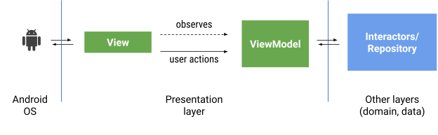
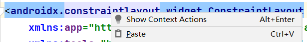
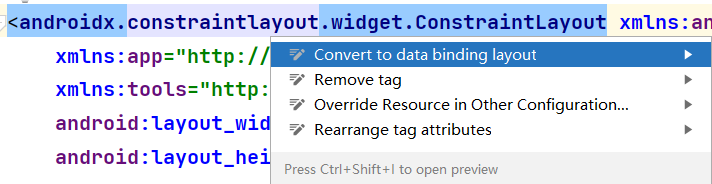
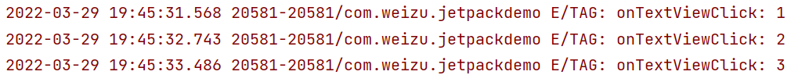
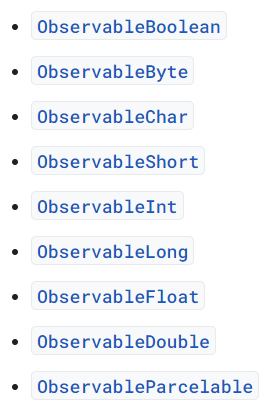
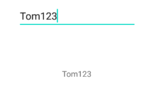

[TOC]
# 1. 说明
> 本篇博客参考[Data Binding in Android (google.cn)](https://developer.android.google.cn/codelabs/android-databinding?hl=en#0) 和 [数据绑定库](https://developer.android.google.cn/topic/libraries/data-binding)


数据绑定可以使用声明性格式（而非程序化地）将布局中的界面组件绑定到应用中的数据源。其实有点类似于`MVVM`框架，数据和显示的部分动态绑定，**当数据发生改变对应的视图也随之改变**。如果您使用数据绑定的主要目的是取代`findViewById()`调用，请考虑改用视图绑定。其模式示意图：


和视图绑定类似，对于`Android Studio`的版本也有要求：
>   Android Studio 3.4 or greater

# 2. 使用
## 2.1 环境准备
类似的，直接在配置文件中添加：
~~~
android {
    ...
    dataBinding {
        enabled = true
    }
}
~~~
将之前的`layout`布局文件修改为`DataBinding layout`。直接右击根布局的标签元素，然后选择**Show Context Actions**：

然后就可以看见提供了直接转换到`data binding`布局的选项：

比如我这里转换后的`xml`布局文件为：
~~~xml
<?xml version="1.0" encoding="utf-8"?>
<layout xmlns:android="http://schemas.android.com/apk/res/android"
    xmlns:app="http://schemas.android.com/apk/res-auto"
    xmlns:tools="http://schemas.android.com/tools">

    <data>

    </data>

    <androidx.constraintlayout.widget.ConstraintLayout
        android:layout_width="match_parent"
        android:layout_height="match_parent"
        tools:context=".MainActivity">

        <TextView
            android:id="@+id/textView"
            android:layout_width="wrap_content"
            android:layout_height="wrap_content"
            android:text="内容"
            android:textSize="24sp"
            app:layout_constraintBottom_toBottomOf="parent"
            app:layout_constraintEnd_toEndOf="parent"
            app:layout_constraintHorizontal_bias="0.498"
            app:layout_constraintLeft_toLeftOf="parent"
            app:layout_constraintRight_toRightOf="parent"
            app:layout_constraintStart_toStartOf="parent"
            app:layout_constraintTop_toTopOf="parent"
            app:layout_constraintVertical_bias="0.194" />

    </androidx.constraintlayout.widget.ConstraintLayout>
</layout>
~~~
在`data`标签中的内容，也就是定义的变量。比如可以定义如下的两个变量：
~~~
<data>
    <import type="android.view.View"/>
    <variable name="name" type="String"/>
    <variable name="message" type="String"/>
</data>
~~~
因为后续需要使用`View`，所以这里需要导入包。对应的，可以使用自定义的类，然后导入对应的包即可。

## 2.2 根据name长度显示Message案例
将定义的变量和布局文件中的控件关联，也就是使用变量。在`Android Jetpack`中定义的使用方式为`@{ expression }`的格式，也就是可以如下使用：

~~~
<TextView
    android:id="@+id/textView"
    android:layout_width="wrap_content"
    android:layout_height="wrap_content"
    android:text="@{ message }"
    android:visibility="@{ (name.length > 3) ? View.VISIBLE : View.GONE }"
    ...
/>
~~~
然后就是在代码中设置在`xml`中申明的两个变量的值。和`viewbinding`类似在`databinding`中也需要在`onCreate`方法替换：
~~~
setContentView(R.layout.plain_activity)
~~~
这里替换为：
~~~
binding = DataBindingUtil.setContentView<ActivityMainBinding>(
    this,
    R.layout.activity_main
)
~~~
所获得的`binding`对象也就是和布局文件相关联的类，即：`ActivityMainBinding`。通过`binding`这个实例，就能够直接操作在`xml`中声明的变量：
~~~
binding.name = "testDemo"
binding.message = "Hello data binding."
~~~
完整代码：
~~~
class MainActivity2 : AppCompatActivity() {

    private lateinit var binding: ActivityMainBinding

    override fun onCreate(savedInstanceState: Bundle?) {
        super.onCreate(savedInstanceState)
        // 1. setContentView(R.layout.plain_activity) replace with below:
        // data binding
        binding = DataBindingUtil.setContentView<ActivityMainBinding>(
            this,
            R.layout.activity_main
        )

        // 2. set the variable values
        binding.name = "testDemo"
        binding.message = "Hello data binding."
    }
}
~~~
结果：


## 2.3 响应点击事件
通常我们可以直接在`xml`中直接设置点击函数，比如：
~~~
android:onClick="onButtonClick"
~~~
然后在`Activity`中定义方法`onButtonClick`。或者直接通过这个按钮的实例对象来注册监听，进行事件处理。这里也是类似，可以在`xml`中采用`Lambda`表达式的方式来注册函数。首先定义一个`SimpleViewModel`类，继承自`ViewModel`类，如下：
~~~kotlin
/**
 * @author 梦否 on 2022/3/29
 * @blog https://mengfou.blog.csdn.net/
 */
class SimpleViewModel: ViewModel() {
    // 定义消息
    var message = "Hello data binding."
        get() {
            return if(clickNumber % 2 == 0) "偶数" else "奇数"
        }
        private set // 阻止外部修改，只支持内部修改

    val name = "testDemo"

    var clickNumber = 0
        private set

    // 定义点击函数
    fun onTextViewClick(){
        clickNumber++
        Log.e("TAG", "onTextViewClick: ${clickNumber}" )
    }
}
~~~
但是，很不幸，点击`TextView`之后，在`TextView`中显示的文本并没有观测到数据的变化。观察日志：


其实，这是因为我们设置的数据并不可观测。我们需要让数据可以**observable**才行。为了让字段可观测，可以使用`observable`类或者`LiveData`。关于可观察的数据对象在`Google`中有详细说明：[使用可观察的数据对象](https://developer.android.google.cn/topic/libraries/data-binding/observability)。

## 2.4 可观察数据类型
可观察类有三种不同类型：对象、字段和集合。
### 2.4.1 可观测对象
实现`Observable`接口的类允许注册监听器，以便它们接收有关可观察对象的属性更改的通知。为便于开发，数据绑定库提供了用于实现监听器注册机制的`BaseObservable`类。实现`BaseObservable`的数据类负责在属性更改时发出通知。具体操作过程是向 getter 分配`Bindable`注释，然后在 setter 中调用`notifyPropertyChanged()`方法。
### 2.4.2 可观测字段
~~~
ObservableField<String>()
~~~
以及基本的：


### 2.4.3 可观察集合
`ObservableArrayMap`、`ObservableArrayList`等。

## 2.5 设置数据可观察
因为这里所使用的为基本类型，比如`message`和`name`。由于这里我只需要`message`可观测，所以这里对其应用可观测字段即可。如下：
~~~kotlin
/**
 * @author 梦否 on 2022/3/29
 * @blog https://mengfou.blog.csdn.net/
 */
class SimpleViewModel : ViewModel() {
    // 定义可观测的字段，使用ObservableField
    var message = ObservableField<String>("Hello data binding.")
        private set // 阻止外部修改，只支持内部修改

    val name = "testDemo"

    var clickNumber = 0
        private set

    // 定义点击函数
    fun onTextViewClick() {
        clickNumber++
        if (clickNumber.rem(2) == 0) message.set("is Even")
        else message.set("is odd")
        Log.e("TAG", "onTextViewClick: ${clickNumber}")
    }
}
~~~
对应的修改在`xml`中的`<data>`标签中的变量声明：
~~~xml
<data>
    <import type="android.view.View" />
    <variable
        name="viewModel"
        type="com.weizu.jetpackdemo.SimpleViewModel" />
</data>
~~~
对应的`MainActivity`文件：

~~~kotlin
class MainActivity2 : AppCompatActivity() {

    private lateinit var binding: ActivityMainBinding

    override fun onCreate(savedInstanceState: Bundle?) {
        super.onCreate(savedInstanceState)
        // 1. setContentView(R.layout.plain_activity) replace with below:
        // data binding
        binding = DataBindingUtil.setContentView<ActivityMainBinding>(
            this,
            R.layout.activity_main
        )

        // set data
        binding.viewModel = SimpleViewModel()
    }
}
~~~
然后就可以看见点击后奇数点击和偶数点击的切换显示文本效果。

## 2.6 数据双向绑定
在这个案例中需要达到的效果为：对应定义的可观测字段`Field`内容的改变可以通知到对应的控件，而控件的内容变化也可以通知到`Field`。所以这里可以使用控件`EditText`。
### 2.6.1 方式一：继承自BaseObservable
在布局文件中定义一个`EditText`和`TextView`，如下：
~~~xml
<?xml version="1.0" encoding="utf-8"?>
<layout xmlns:android="http://schemas.android.com/apk/res/android"
    xmlns:app="http://schemas.android.com/apk/res-auto"
    xmlns:tools="http://schemas.android.com/tools">

    <data>
        <variable
            name="myViewModel"
            type="com.weizu.jetpackdemo.databinding.MyViewModel" />
    </data>

    <androidx.constraintlayout.widget.ConstraintLayout
        android:layout_width="match_parent"
        android:layout_height="match_parent"
        tools:context=".databinding.MainActivity">


        <EditText
            android:id="@+id/editText"
            android:layout_width="wrap_content"
            android:layout_height="wrap_content"
            android:ems="10"
            android:inputType="textPersonName"
            android:text="@={ myViewModel.userInput }"
            app:layout_constraintBottom_toBottomOf="parent"
            app:layout_constraintEnd_toEndOf="parent"
            app:layout_constraintStart_toStartOf="parent"
            app:layout_constraintTop_toTopOf="parent" />

        <TextView
            android:id="@+id/textView2"
            android:layout_width="wrap_content"
            android:layout_height="wrap_content"
            android:text="@{ myViewModel.userInput }"
            app:layout_constraintBottom_toBottomOf="parent"
            app:layout_constraintEnd_toEndOf="parent"
            app:layout_constraintHorizontal_bias="0.498"
            app:layout_constraintStart_toStartOf="parent"
            app:layout_constraintTop_toTopOf="parent"
            app:layout_constraintVertical_bias="0.675" />

    </androidx.constraintlayout.widget.ConstraintLayout>
</layout>
~~~
值得注意的是，在`EditText`中设置为：
```xml
 android:text="@={ myViewModel.userInput }"
```
而在`TextView`中为：
```xml
 android:text="@{ myViewModel.userInput }"
```
因为在`EditText`中我们需要完成双向绑定，即用户输入可以通知到`LiveData`，而在`TextView`中只要加载变化后的数据即可。
那么，在自定义`ViewModel`中为：
~~~kotlin
/**
 * @author 梦否 on 2022/4/20
 * @blog https://mengfou.blog.csdn.net/
 */
class MyViewModel :BaseObservable(){

    // 设置为LiveData，便于布局文件中TextView内容的自动更新
    private val userInput = MutableLiveData<String>("Tom")

    // 这里一定不要忘记添加注解@Bindable，否则双向绑定不会生效
    @Bindable
    @JvmName("getUserInput")
    fun getUserInput(): String{
        return userInput.value.toString()
    }

    // 用于更新TextView
    fun get(): LiveData<String> {
        return this.userInput
    }

    @JvmName("setUserInput")
    fun setUserInput(str: String){
        if(!str.equals(userInput)) {
            this.userInput.value = str
        }
        Log.e("TAG", "setValue: ${str}" )
        // 通知数据发生了改变
        notifyPropertyChanged(BR.myViewModel)  // build后会自动生成一个BR类，对应在xml中声明的变量
    }
}
~~~
这里为了完成双向绑定，继承自`BaseObservable`，且在`get`方法上使用了`@Bindable`注解来表示绑定。至于`get()`方法仅是为了返回`LiveData`对象，然后在`Activity`中设置观察，更新`TextView`控件内容：
~~~kotlin
class MainActivity : AppCompatActivity() {
    override fun onCreate(savedInstanceState: Bundle?) {
        super.onCreate(savedInstanceState)
        val binding =
            DataBindingUtil.setContentView<ActivityMain2Binding>(
                this,
                R.layout.activity_main2
            )
        // 这里直接使用new一个对象
        // 因为这里的自定义ViewModel继承的是BaseObservable类，不是ViewModel类
        val myViewModel = MyViewModel()
        binding.myViewModel = myViewModel
        // 设置观察，以更新TextView文本
        myViewModel.get().observe(this) {
            binding.textView2.text = myViewModel.get().value
        }
    }
}
~~~
效果：

### 2.6.2 方式二：继承自ObservableField
布局文件还是保持不变：
~~~xml
<?xml version="1.0" encoding="utf-8"?>
<layout xmlns:android="http://schemas.android.com/apk/res/android"
    xmlns:app="http://schemas.android.com/apk/res-auto"
    xmlns:tools="http://schemas.android.com/tools">

    <data>
        <variable
            name="myViewModel"
            type="com.weizu.jetpackdemo.databinding.MyViewModel" />
    </data>

    <androidx.constraintlayout.widget.ConstraintLayout
        android:layout_width="match_parent"
        android:layout_height="match_parent"
        tools:context=".databinding.MainActivity">

        <EditText
            android:id="@+id/editText"
            android:layout_width="wrap_content"
            android:layout_height="wrap_content"
            android:ems="10"
            android:inputType="textPersonName"
            android:text="@={ myViewModel.userInput }"
            app:layout_constraintBottom_toBottomOf="parent"
            app:layout_constraintEnd_toEndOf="parent"
            app:layout_constraintStart_toStartOf="parent"
            app:layout_constraintTop_toTopOf="parent" />

        <TextView
            android:id="@+id/textView2"
            android:layout_width="wrap_content"
            android:layout_height="wrap_content"
            android:text="@{ myViewModel.userInput }"
            app:layout_constraintBottom_toBottomOf="parent"
            app:layout_constraintEnd_toEndOf="parent"
            app:layout_constraintHorizontal_bias="0.498"
            app:layout_constraintStart_toStartOf="parent"
            app:layout_constraintTop_toTopOf="parent"
            app:layout_constraintVertical_bias="0.675" />

    </androidx.constraintlayout.widget.ConstraintLayout>
</layout>
~~~
对于`ViewModel`进行删减：
~~~kotlin
class MyViewModel {
    // 设置为可观察类型
    val userInput = ObservableField<String>("Tom")
}
~~~
最后在`Activity`中进行设置数据：
~~~kotlin
class MainActivity : AppCompatActivity() {
    override fun onCreate(savedInstanceState: Bundle?) {
        super.onCreate(savedInstanceState)
        val binding =
            DataBindingUtil.setContentView<ActivityMain2Binding>(
                this,
                R.layout.activity_main2
            )
        // 这里直接使用new一个对象
        // 因为这里的自定义ViewModel继承的是BaseObservable类，不是ViewModel类
        val myViewModel = MyViewModel()
        binding.myViewModel = myViewModel
        // 在xml文件：@=操作符进行双向绑定
    }
}
~~~
达到的效果和上小节一样。

## 2.7 RecyclerView+dataBinding
可以使用`databinding`来设置每个`item`的内容。比如在主布局文件：
~~~xml
<?xml version="1.0" encoding="utf-8"?>
<layout xmlns:android="http://schemas.android.com/apk/res/android"
    xmlns:app="http://schemas.android.com/apk/res-auto"
    xmlns:tools="http://schemas.android.com/tools">

    <androidx.constraintlayout.widget.ConstraintLayout
        android:layout_width="match_parent"
        android:layout_height="match_parent"
        tools:context=".recycleview.MainActivity">

        <androidx.recyclerview.widget.RecyclerView
            android:id="@+id/recyclerView"
            android:layout_width="0dp"
            android:layout_height="0dp"
            app:layout_constraintBottom_toBottomOf="parent"
            app:layout_constraintEnd_toEndOf="parent"
            app:layout_constraintStart_toStartOf="parent"
            app:layout_constraintTop_toTopOf="parent" />

    </androidx.constraintlayout.widget.ConstraintLayout>
</layout>
~~~
因为使用了`RecyclerView`，所以这里还是定义对应的适配器：
~~~kotlin
/**
 * @author 梦否 on 2022/4/20
 * @blog https://mengfou.blog.csdn.net/
 */
class MyRecycleViewAdapter(var context: Context, var datas: List<User>) :
    RecyclerView.Adapter<MyRecycleViewAdapter.MyViewHolder>() {

    override fun onCreateViewHolder(parent: ViewGroup, viewType: Int): MyViewHolder {
        val inflater = LayoutInflater.from(context)
        val binding = DataBindingUtil.inflate<RecyclerviewItemBinding>(
            inflater,
            R.layout.recyclerview_item,
            parent,
            false
        )
        val myViewHolder = MyViewHolder(binding.root)
        myViewHolder.binding = binding
        return myViewHolder
    }

    override fun onBindViewHolder(holder: MyViewHolder, position: Int) {
        holder.binding?.user = datas[position]
        Log.e("TAG", "onBindViewHolder: ${position} + ${ datas[position].name }")
    }

    override fun getItemCount(): Int {
        return datas.size
    }

    inner class MyViewHolder(var root: View) : RecyclerView.ViewHolder(root) {
        var binding: RecyclerviewItemBinding? = null
    }
}
~~~
同样的在`R.layout.recyclerview_item`布局文件中设置`databinding`：
~~~xml
<?xml version="1.0" encoding="utf-8"?>
<layout xmlns:android="http://schemas.android.com/apk/res/android"
    xmlns:app="http://schemas.android.com/apk/res-auto"
    xmlns:tools="http://schemas.android.com/tools"
    >

    <data>
        <variable
            name="user"
            type="com.weizu.jetpackdemo.recycleview.User" />
    </data>
    <androidx.constraintlayout.widget.ConstraintLayout
        android:layout_width="match_parent"
        android:layout_height="match_parent">

        <TextView
            android:id="@+id/textView3"
            android:layout_width="wrap_content"
            android:layout_height="wrap_content"
            android:text="@{ user.name }"
            app:layout_constraintBottom_toTopOf="@+id/textView4"
            app:layout_constraintEnd_toEndOf="parent"
            app:layout_constraintStart_toStartOf="parent"
            app:layout_constraintTop_toTopOf="parent" />

        <androidx.constraintlayout.widget.Guideline
            android:id="@+id/guideline3"
            android:layout_width="wrap_content"
            android:layout_height="wrap_content"
            android:orientation="horizontal"
            app:layout_constraintGuide_begin="93dp" />

        <androidx.constraintlayout.widget.Guideline
            android:id="@+id/guideline4"
            android:layout_width="wrap_content"
            android:layout_height="wrap_content"
            android:orientation="horizontal"
            app:layout_constraintGuide_begin="20dp" />

        <TextView
            android:id="@+id/textView4"
            android:layout_width="wrap_content"
            android:layout_height="wrap_content"
            android:text="@{ String.valueOf(user.age) }"
            app:layout_constraintBottom_toTopOf="@+id/guideline3"
            app:layout_constraintEnd_toEndOf="parent"
            app:layout_constraintStart_toStartOf="parent"
            app:layout_constraintTop_toTopOf="parent" />

        <ImageView
            android:id="@+id/imageView2"
            android:layout_width="wrap_content"
            android:layout_height="wrap_content"
            android:layout_marginStart="16dp"
            android:layout_marginTop="1dp"
            android:imageSrc="@{ user.image }"
            app:layout_constraintEnd_toStartOf="@+id/textView4"
            app:layout_constraintStart_toStartOf="parent"
            app:layout_constraintTop_toTopOf="parent"
            tools:srcCompat="@tools:sample/avatars" />
    </androidx.constraintlayout.widget.ConstraintLayout>
</layout>
~~~
对于`User`类比较简单：
~~~kotlin
class User(var age: Int, var name: String) {
    var image = "https://i1.hdslb.com/bfs/face/7e72c58637ff26df68fb30939de078d2bbbfcdbe.jpg"
}
~~~
在主`Activity`中配置：
~~~kotlin
class MainActivity : AppCompatActivity() {
    override fun onCreate(savedInstanceState: Bundle?) {
        super.onCreate(savedInstanceState)
        val binding =
            DataBindingUtil.setContentView<ActivityMain3Binding>(
                this,
                R.layout.activity_main3
            )

        val datas = listOf<User>(
            User(12, "Jack"),
            User(10, "Tom"),
            User(23, "Joe")
        )
        // 必须设置布局管理器，否则不会显示RecyclerView
        binding.recyclerView.layoutManager = LinearLayoutManager(this)
        binding.recyclerView.adapter = MyRecycleViewAdapter(this, datas)
    }
}
~~~
运行即可看见效果。

# 3. 自定义BindingAdapter
参考视频地址：[https://www.bilibili.com/video/BV1Ry4y1t7Tj?p=12](https://www.bilibili.com/video/BV1Ry4y1t7Tj?p=12)
这个案例感觉比较典型，达到的效果为可以使用`databinding`的方式传入一个图片的链接地址，然后可以通过注解的方式来**直接**定义属性字段。然后可以完成加载。比如下面的案例：
布局文件：
~~~xml
<?xml version="1.0" encoding="utf-8"?>
<layout xmlns:android="http://schemas.android.com/apk/res/android"
    xmlns:app="http://schemas.android.com/apk/res-auto"
    xmlns:tools="http://schemas.android.com/tools">

    <data>
        <variable
            name="src"
            type="String" />
    </data>

    <androidx.constraintlayout.widget.ConstraintLayout
        android:layout_width="match_parent"
        android:layout_height="match_parent"
        tools:context=".BindingAdapterActivity">

        <ImageView
            android:id="@+id/imageView"
            android:layout_width="300dp"
            android:layout_height="300dp"
            app:imageSrc="@{ src }"
            app:layout_constraintBottom_toBottomOf="parent"
            app:layout_constraintEnd_toEndOf="parent"
            app:layout_constraintStart_toStartOf="parent"
            app:layout_constraintTop_toTopOf="parent"
            tools:srcCompat="@tools:sample/avatars" />
    </androidx.constraintlayout.widget.ConstraintLayout>
</layout>
~~~
注意到，在`ImageView`标签中直接设置了自定义的字段：
```xml
 app:imageSrc="@{ src }"
```
而这个字段以前我们是需要使用`tool:`并定义对应的`styleable`样式。这里并不需要，仅需要使用注解来申明：
~~~kotlin
class ImageViewCus {

    // 需要注意的是，这里需要使用静态方法
   companion object{

       @JvmStatic
       @BindingAdapter("app:imageSrc")
       fun loadImage(imageView: ImageView, str: String){
           Glide.with(imageView.context)
               .load(str)
               .placeholder(R.drawable.ic_launcher_background)
               .into(imageView)
       }
   }
}
~~~
最后是在`Activity`中使用：
~~~kotlin
class MyBindingAdapterActivity : AppCompatActivity() {
    override fun onCreate(savedInstanceState: Bundle?) {
        super.onCreate(savedInstanceState)
        val binding = DataBindingUtil.setContentView<ActivityBindingAdapterBinding>(
            this,
            R.layout.activity_binding_adapter
        )
        binding.src = "https://img-blog.csdnimg.cn/5690c131d90e460fa4c96bf86b1ae634.png"
    }
}
~~~
传入`databinding`中声明的字符串即可，就可以达到预期的效果。整体的使用流程感觉和`SpringBoot`中的类似，但是这里比较好奇的是难道这里也会扫描所有包/类中的注解？应该是的，等储备知识够了再深入。


